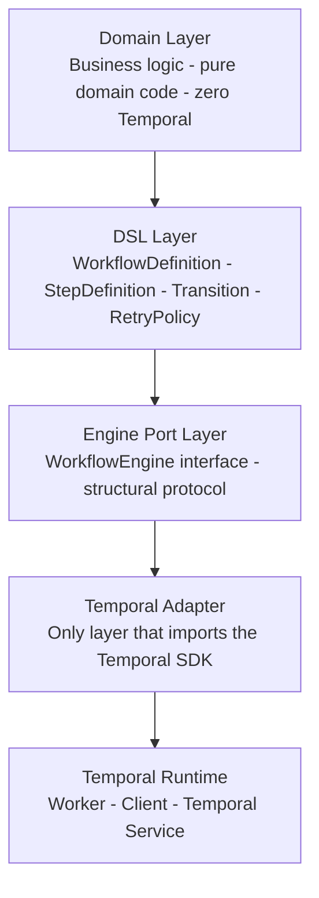

# Architecture: 4-Layer Temporal Abstraction

## Layer Diagram

Each layer has a single responsibility. The arrow direction indicates dependency — upper layers depend on lower layers, never the reverse.

---

## Layer Roadmap

| Phase | Layer | What You Build | Key Deliverables |
|-------|-------|----------------|------------------|
| Phase 1 | DSL Layer | Workflow graph definition | `WorkflowDefinition`, `StepDefinition`, `Transition`, `RetryPolicy` models; graph validation; in-memory executor |
| Phase 2 | Engine Port + Temporal Adapter + Action Registry | Abstraction boundary + Temporal integration | `WorkflowEngine` interface, `TemporalAdapter`, `ActionRegistry`, worker setup |
| Phase 3 | Production Hardening | Retry, signals, observability, persistence | `RetryPolicy` wiring, signal/query through Port, OpenTelemetry, `WorkflowInstance` model |
| Phase 4 | Advanced Patterns | Orchestration philosophy + adaptive depth | Decision layer framing, experience-based branching, stack-agnostic portability |

---

## Architecture Principles

- Temporal is an execution engine, not the source of truth for workflow definition. The `WorkflowDefinition` DSL model owns the authoritative graph.
- Domain code has zero Temporal imports. Business logic is expressed in pure domain code with no dependency on the Temporal SDK package.
- The DSL layer is infrastructure-free — define the workflow graph without a running Temporal server.
- The Port layer uses a structural interface / protocol for the engine abstraction. The `WorkflowEngine` interface requires no inheritance from Temporal SDK types.
- Only the Temporal Adapter imports from the Temporal SDK. All Temporal primitives (workflow definition decorators, activity decorators, activity execution calls) are confined to the adapter layer.
- Activities delegate to application services — no business logic in activity functions. The activity function calls a service method and returns the result.
- The architecture is testable at every layer without a running Temporal server. The in-memory executor validates the DSL graph; the Port interface can be stubbed; the Adapter is the only layer requiring Temporal infrastructure.
