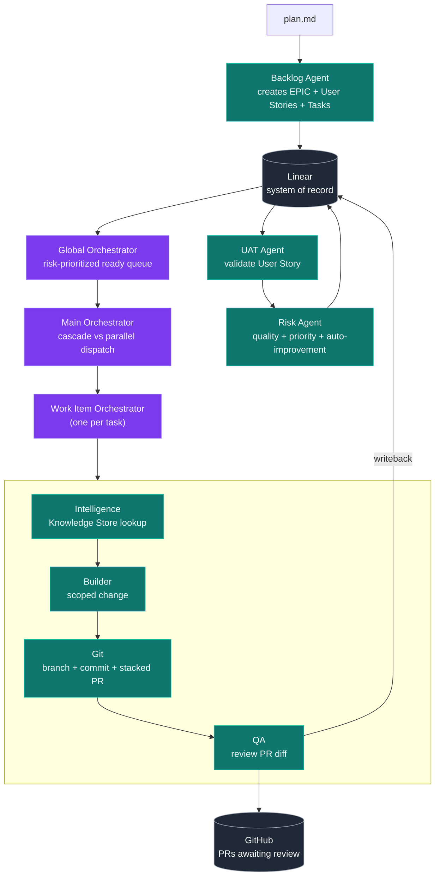
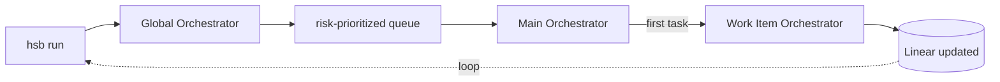
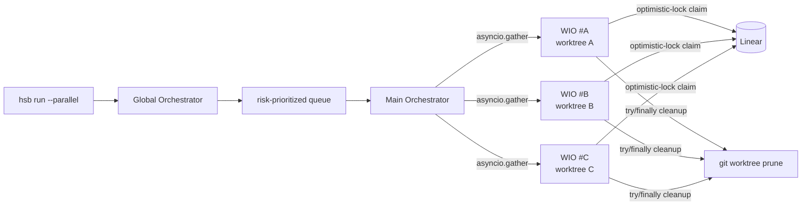
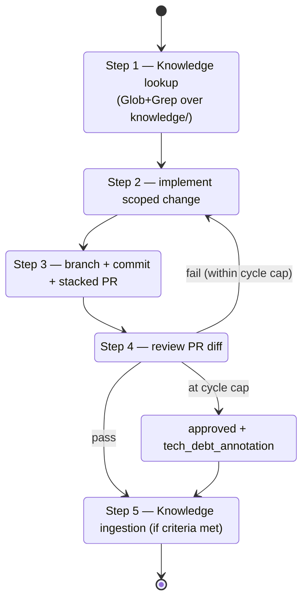
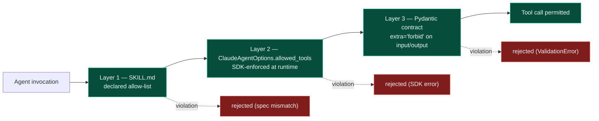

# HSBTech — AI Engineering Workflow

[](https://www.python.org/)
[](https://docs.anthropic.com/)
[](https://linear.app/)
[](https://github.com/)

> A coordinated multi-agent system that turns a documented plan into traceable, QA-reviewed software delivery via Linear and GitHub. Built on the Claude Agent SDK with structurally-enforced capability boundaries and a deterministic, risk-based prioritizer.

---

## Table of contents

1. [What this is](#what-this-is)
2. [How it works](#how-it-works)
3. [The agents](#the-agents)
4. [Operating modes](#operating-modes)
5. [Work Item Orchestrator lifecycle](#work-item-orchestrator-lifecycle)
6. [Guardrails](#guardrails)
7. [Capability-boundary defense](#capability-boundary-defense)
8. [Repository layout](#repository-layout)
9. [Tech stack](#tech-stack)
10. [Installation](#installation)
11. [CLI reference](#cli-reference)
12. [Knowledge Store](#knowledge-store)
13. [Test suite](#test-suite)
14. [Design rules and constraints](#design-rules-and-constraints)
15. [Project history](#project-history)
16. [See also](#see-also)
17. [License](#license)

---

## What this is

HSBTech turns a documented plan into a complete engineering execution flow. Linear is the durable system of record; GitHub is the code-delivery surface. Every merge to `main` is human-approved. Every agent action is structured JSON in / JSON out, traceable by Linear comment and Git commit.



The runtime is the Claude Agent SDK. Every agent fits one of three patterns: a stateful `ClaudeSDKClient` session (Work Item Orchestrator), a one-shot `query()` session (UAT, Risk auto-improvement skill), or a pure-Python class (Risk scoring, Global Orchestrator, Main Orchestrator).

---

## How it works

Three orchestration levels, deliberately separated by responsibility:


| Level | Class | Decides | Runtime pattern |
|-------|-------|---------|-----------------|
| **L0 — Main** | `MainOrchestrator` | Cascade vs parallel · dispatch budget · worktree lifecycle | Pure Python (deterministic) |
| **L1 — Global** | `GlobalOrchestrator` | What's ready (no blocking deps) · risk priority · UAT readiness | Pure Python (deterministic) |
| **L2 — Work Item** | `WorkItemOrchestrator` | The full lifecycle of one task — Builder → Git → QA → fix loop | Single Claude SDK session (LLM, bounded) |

L0 and L1 are deterministic. L2 is the only place LLM reasoning drives a multi-step lifecycle, and it is bounded: capped QA cycles per task, structurally-enforced no-sub-subagent dispatch, no `Agent` tool in `allowed_tools`. The same Work Item Orchestrator runs in cascade and parallel — the only difference is whether `MainOrchestrator` invokes one at a time or via `asyncio.gather` with worktree isolation.

---

## The agents

Source files live under `src/hsb/agents/`. Skills (behavioral specs injected as system prompts) live under `.claude/skills/`. Pydantic input/output contracts live under `src/hsb/contracts/`.

| Agent | File | Role | Capability stance | Runtime pattern |
|-------|------|------|-------------------|-----------------|
| **Linear Agent** | `linear_agent.py` | All Linear MCP I/O. Provides `run_linear_agent` and `run_validated_linear_agent` (Pydantic-gated retry self-correction). Implements optimistic-lock procedure (read `updatedAt` → write → re-read → verify). | Linear MCP only; `linear_write_guard` denies callers from `risk_agent.py`. | One-shot `query()` |
| **Backlog Agent** | `backlog_agent.py` | Reads `plan.md`, produces `BacklogOutput` (EPIC + User Stories + Tasks + Subtasks). Idempotent on rerun. | Allow-list: Linear `create_issue`, `list_issues`, `get_issue`, `Read`. | One-shot `query()` |
| **Builder Agent** | `builder_agent.py` | Implements only the scoped change for one Task. | Allow-list: filesystem + bounded `Bash` for test/lint/typecheck. **No** `mcp_servers`, **no** git, **no** Linear. | One-shot `query()` |
| **Git Agent** | `git_agent.py` | Branch `feature/LIN-{id}-{slug}`, commit, open stacked PR (Task PRs target `epic/LIN-...`, never `main`). Owns `REBASE_STACK` for sibling PRs. | Allow-list: `gh pr create/view/diff`, `git push --force-with-lease`. **No** `Edit`, **no** `Write`, **no** `git merge`, **no** `gh pr merge`, **no** `mcp__linear__*`. | One-shot `query()` |
| **QA Agent** | `qa_agent.py` | Reviews PR diff against requirements. Emits findings or approves. | Allow-list: `Read`, `gh pr diff`, `gh pr view`. Triple-layer cycle cap (system prompt + Pydantic `model_validator` + integration test). | One-shot `query()` |
| **Work Item Orchestrator** | `work_item_orchestrator.py` | Drives one Linear task end-to-end (Intelligence → Builder → Git → QA → fix loop). Inline skill injection. | No sub-subagent dispatch: `agents=` kwarg absent, `AgentDefinition` not imported, runtime backstop in every receive loop. | Stateful `ClaudeSDKClient` |
| **Global Orchestrator** | `global_orchestrator.py` | Reads Linear state, filters dependency-blocked tasks, calls `RiskAgent.get_priority_queue()`, detects UAT-ready User Stories, dispatches UAT inline. | Pure Python, no SDK session, no LLM. | Pure Python async |
| **Main Orchestrator** | `main_orchestrator.py` | Dispatch controller. Cascade runs WIOs sequentially. Parallel uses `asyncio.gather(..., return_exceptions=True)` with optimistic-lock claiming + worktree isolation + `try/finally` cleanup + startup `git worktree prune`. | Subprocess env is a strict allowlist (no `**os.environ`). | Pure Python async |
| **Intelligence Agent** | `intelligence_agent.py` (+ inline in WIO) | Embedded inline in the WIO via the knowledge skills. Pre-Builder: queries Knowledge Store via Glob+Grep, populates `knowledge_context`. Post-QA: evaluates findings, writes a new entry if ingestion criteria are met. | `KnowledgeStorageInput` rejects `applicability` of "all tasks" / "n/a" / "tbd" / empty. | Inline (no separate process) |
| **UAT Agent** | `uat_agent.py` | Validates User Story acceptance criteria. Produces scenario pass/fail with evidence. | Allow-list: `Read`, `Glob`, `Grep`, `Bash`. **No** `Write`, **no** `Edit`, **no** `Agent`, **no** Linear MCP. `mcp_servers=None`. SCOPE BOUNDARY literal in every prompt. | One-shot `query()` |
| **Risk Agent** | `risk_agent.py` | Deterministic quality scoring + adaptive prioritization (pure Python). Auto-improvement-trigger detection runs as an isolated SDK call (`allowed_tools=[]`, `mcp_servers=None`, Haiku, tight `max_turns` and budget). | Never writes to Linear directly — multiple structural defenses including no `linear_agent` import, `linear_write_guard`, and a `Literal["suggested"]` Pydantic field. | Pure Python + isolated `query()` |

### Sentinel module

**`src/hsb/agents/_sdk_options.py`** is the chokepoint that enforces the Claude SDK guardrails structurally. Every SDK call site routes through `make_options()`, which calls `assert_oauth2_only()` and refuses any `allowed_tools` containing `"Agent"`. It also exports `assert_no_task_dispatch(msg)` (the runtime backstop) and `linear_write_guard` (the stack-inspection decorator on Phase 1 Linear write methods).

---

## Operating modes

### Cascade (default)



Ideal for: development, debugging, single-developer workflows, MVP usage. Run `python run_loop.py` to repeat until the backlog is empty or `Ctrl+C`.

### Parallel



Ideal for: throughput, multi-task parallelism on independent EPICs, post-MVP scale. Optimistic-lock claiming via `updatedAt` re-read prevents double-claims. Each WIO runs in its own `.worktrees/<task-slug>` git worktree, cleaned up in `try/finally`. The parallel acceptance gate (`tests/integration/test_parallel_mode_e2e.py::test_no_double_claim_parallel_two_tasks`) verifies correctness against a real Linear test workspace.

---

## Work Item Orchestrator lifecycle

A single Claude Agent SDK session driving one Linear task through its full lifecycle. The fix loop is bounded by a cycle cap; on the final cycle, QA must approve with a `tech_debt_annotation`.



Skills concatenated into the system prompt at startup include task orchestration plus the four execution skills (backlog/implementation/git/QA), plus the two knowledge skills. The session has **no** sub-subagent dispatch — `agents=` kwarg absent, `AgentDefinition` not imported, runtime backstop in every receive loop.

---

## Guardrails

Stable invariant IDs with structural enforcement. The mechanism column points at the chokepoint that makes each guardrail load-bearing rather than aspirational.

| ID | What it enforces | Mechanism | Where |
|----|------------------|-----------|-------|
| **G1** | OAuth2-only — no API keys | `assert_oauth2_only()` function-entry guard + `_gsd_clear_api_key` autouse session fixture | `_sdk_options.py`, `tests/conftest.py` |
| **G2** | No `Agent` tool in `allowed_tools` (no sub-subagent dispatch) | `make_options()` factory raises `ValueError` | `_sdk_options.py` |
| **G3** | Runtime backstop for G2 — catches SDK regressions | `assert_no_task_dispatch(msg)` in every receive loop | WIO, Risk Agent, UAT Agent |
| **G4** | Risk Agent auto-improvement is structurally air-gapped | `allowed_tools=[]`, `mcp_servers=None`, Haiku, tight `max_turns` + `max_budget_usd` | `risk_agent.py` |
| **G5** | Linear writes denied for callers from `risk_agent.py` (except via explicit delegated path) | `linear_write_guard` stack-inspection decorator | `linear_agent.py` |
| **G6** | UAT cycle cap is a project-wide invariant | Global Orchestrator skips re-dispatch + posts escalation comment (camelCase `issueId`, `body`) | `global_orchestrator.py` |
| **G7** | `error_max_turns` raises `RuntimeError` — no silent loop continuation | `if msg.stop_reason == "error_max_turns": raise` in every SDK loop | WIO, UAT, Risk |
| **G8** | WIO context-budget warning at the configured input-token threshold | WARN log emitted in receive loops | WIO Steps 2–5 |
| **G9** | Knowledge Store pre-write hook | `KnowledgeStorageInput.applicability` validator + `extra="forbid"` | `contracts/knowledge.py` |
| **G10** | UAT pre-persist validation (UAT coverage + banned-token regex) | `_uat_passes_g10` helper called twice in `get_ready_tasks` | `global_orchestrator.py` |

The **RISK-04** invariant (Risk Agent never writes to Linear directly) has multiple layers of structural defense: no `linear_agent` import in `risk_agent.py`, the `linear_write_guard` decorator, a `Literal["suggested"]` Pydantic field, and `allowed_tools=[]` on the auto-improvement skill.

---

## Capability-boundary defense

Every agent is sandboxed by three independent layers. A regression in one layer does not breach the boundary because the other two still hold.



| Layer | Where it lives | What it catches |
|-------|----------------|-----------------|
| SKILL.md allow-list | `.claude/skills/<skill>/SKILL.md` | Drift between declared and actual capability |
| `ClaudeAgentOptions.allowed_tools` | Per-agent factory in `src/hsb/agents/*.py` | Runtime tool calls outside the allow-list |
| Pydantic `extra="forbid"` | `src/hsb/contracts/*.py` | Schema drift in agent input/output (FOUND-03) |

Cross-cutting checks (the `_sdk_options.py` chokepoint, `linear_write_guard`, `assert_no_task_dispatch`) sit on top of these layers.

---

## Repository layout

```
.
├── src/hsb/
│   ├── agents/                 # Linear, Backlog, Builder, Git, QA, WIO, Global, Main, UAT, Risk, Intelligence
│   │   ├── _sdk_options.py     # G1/G2/G3/G5 chokepoint module
│   │   └── hooks.py            # Phase 1 LINEAR_HOOKS (retry/audit/PreCompact/filter)
│   ├── cli/                    # Typer CLI surface
│   │   ├── main.py             # hsb create-issue / update-issue / add-comment / link-pr / run / run-next-step / show-state / show-next-action
│   │   └── backlog.py · builder.py · git.py · qa.py   # per-agent subgroups
│   └── contracts/              # Pydantic models — all extra="forbid"
│       ├── linear.py · backlog.py · builder.py · git.py · qa.py
│       ├── orchestrator.py · global_orchestrator.py · main_orchestrator.py
│       └── knowledge.py · risk.py · uat.py · base.py
├── .claude/skills/             # SKILL.md files migrated from skills/
│   ├── linear-system-of-record/
│   ├── backlog-planning/ · implementation/ · git-pr-management/ · qa-review/
│   ├── task-orchestration/
│   ├── global-orchestration/ · main-orchestrator/
│   ├── knowledge-context-enrichment/ · knowledge-storage/
│   ├── quality-scoring-risk-analysis/ · adaptive-prioritization/ · auto-improvement-triggers/
│   └── uat-validation/
├── knowledge/                  # Persistent file-based Knowledge Store
│   └── architecture/ · qa/ · implementation/ · backlog/ · risk/ · patterns/ · anti-patterns/
├── tests/
│   ├── unit/                   # pytest tests/unit/ -x -q
│   ├── evals/code_based/       # B1 UAT coverage + B3 banned-token regex
│   └── integration/            # gated by `-m integration` and live env vars
├── agents/                     # Spec docs (input source for skill migration)
│   ├── AGENT-CONTRACTS.md      # JSON schemas for agent input/output
│   └── AGENTS.md               # Agent responsibilities + capability boundaries
├── runtime/RUNTIME-EXECUTION.md   # Golden rules (no sub-subagent dispatch, one action per cycle)
├── skills/                     # Behavioral specs — sources for SKILL.md migration
├── docs/                       # Architecture concept docs
├── .planning/                  # GSD workflow planning artifacts
│   ├── PROJECT.md · ROADMAP.md · REQUIREMENTS.md · STATE.md
│   ├── MILESTONE-UAT.md
│   ├── v1.0-MILESTONE-AUDIT.md
│   └── phases/01-..05/         # Per-phase CONTEXT, RESEARCH, PATTERNS, AI-SPEC, VALIDATION, VERIFICATION, PLAN, SUMMARY
├── run_loop.py                 # Repo-root continuous loop (CLIR-04)
├── pyproject.toml              # hsb-agents — Python ≥3.12
└── uv.lock
```

---

## Tech stack

| Component | Pin | Role |
|-----------|-----|------|
| Python | ≥3.12 | Runtime |
| `claude-agent-sdk` | ≥0.1.73, <0.2.0 | LLM session orchestration |
| `pydantic` | ≥2.0 | Contract validation, schema-drift defense (`extra="forbid"`) |
| `typer` | ≥0.12 | CLI |
| `rich` | ≥13.0 | CLI rendering |
| `python-dotenv` | ≥1.0 | `.env` loading |
| `pytest` + `pytest-asyncio` | 8.x · ≥0.23 | Test framework |
| `hypothesis` | ≥6.100 | Property tests for the deterministic risk formula |
| Linear MCP | `mcp.linear.app/mcp` | System of record |
| GitHub CLI (`gh`) | latest | PR delivery |

The optional `[eval]` extra installs `arize-phoenix`, `opentelemetry-sdk`, and `opentelemetry-exporter-otlp` for production tracing per the AI-SPEC.

---

## Installation

```bash
git clone <repo-url> hsb && cd hsb
python3.12 -m venv .venv && source .venv/bin/activate
pip install -e ".[dev,eval]"
hsb --help          # confirms Typer CLI is registered
```

For the operator UAT pathway (live Linear MCP + GitHub PR runs), see [GET-STARTED.md](./GET-STARTED.md) — covers OAuth2 token, Linear MCP browser flow, sandbox issue setup, and the `hsb-test-fixture` GitHub repo.

---

## CLI reference

### Linear ops

```bash
hsb create-issue        # Create EPIC / User Story / Task / Subtask with parent linkage (LINR-01)
hsb update-issue        # Update status / qa_status / uat_status / assigned_orchestrator (LINR-02)
hsb add-comment         # Add structured comment (decision / QA finding / impl note) (LINR-03)
hsb link-pr             # Link GitHub PR URL to a Linear work item (LINR-04)
```

### Per-agent CLI subgroups

```bash
hsb backlog ...         # Backlog Agent commands
hsb builder ...         # Builder Agent commands
hsb git ...             # Git Agent commands (incl. `hsb git rebase-stack`)
hsb qa ...              # QA Agent commands
```

### Orchestration

```bash
hsb run-next-step       # Trigger ONE Work Item Orchestrator cycle (cascade default) — CLIR-01
hsb run                 # Drive cycles via Global + Main Orchestrators
hsb run --parallel      # Parallel mode: optimistic claiming + worktree isolation
hsb show-state          # Render Linear EPICs / tasks / QA / PR links — CLIR-02
hsb show-next-action    # Dry-run — show next decision without side effects — CLIR-03
```

### Continuous loop

```bash
python run_loop.py      # Repeats `hsb run` until backlog empty or Ctrl+C — CLIR-04
```

All CLI handlers wrap their async work in `asyncio.run()` at the Typer body — never inside coroutines (CLIR-05). State lives in Linear, not the CLI process.

---

## Knowledge Store

The Intelligence Agent's persistent state. Flat markdown + YAML frontmatter, file-based, no vector DB (per the ADVL-01 deferral).

```
knowledge/
├── architecture/    # System-level decisions
├── qa/              # Recurring QA findings → preventive guidance
├── implementation/  # Reusable patterns / techniques
├── backlog/         # Plan-decomposition lessons
├── risk/            # Failure-mode patterns and Auto-Improvement Trigger material
├── patterns/        # Project-wide patterns
└── anti-patterns/   # What not to do
```

Every entry is validated by the `KnowledgeStorageInput` Pydantic model. The `applicability` field rejects `"all tasks"`, `"n/a"`, `"tbd"`, and empty values (G9 — prevents Knowledge Store contamination, INTL-02 ingestion criteria). Required fields cover title, type, context, evidence (Linear issue ID + PR URL + files), insight, recommendation, applicability, and date.

Retrieval is Glob+Grep at MVP scale. If the store grows past the documented scaling threshold with degrading retrieval precision, `rank-bm25` is the documented upgrade path (no vector DB, no new framework dependency).

---

## Test suite

```bash
pytest tests/unit/ -x -q                    # unit tests
pytest tests/evals/code_based/ -x -q        # B1 UAT coverage + B3 banned-token regex
pytest -m integration                       # integration tests (skip without live env vars)
```

**Real-data integration testing stance.** Integration suites run against a real Linear workspace + the real `hsb-test-fixture` GitHub repo. No mocking. Tests skip cleanly without env vars via `_require_*` helpers. Operator setup pathway: see [GET-STARTED.md](./GET-STARTED.md) and [`.planning/MILESTONE-UAT.md`](./.planning/MILESTONE-UAT.md).

**Property-based testing.** The Risk Agent quality score (RISK-01) uses `hypothesis @given` to verify determinism across the input space.

**Eval framework.** Phoenix (Arize) is the recommended production-tracing path per the Phase 5 AI-SPEC.

---

## Design rules and constraints

### Hard rules (architectural invariants)

1. **No automatic merge to `main`** — every EPIC PR merge is human-approved. There is no `gh pr merge` in any allow-list anywhere.
2. **One action per Work Item Orchestrator cycle** — prevents runaway automation. Enforced by the QA cycle cap and `error_max_turns` raises.
3. **No sub-subagent dispatch (WORC-02)** — the WIO is one Claude Agent SDK session. No nested sessions. Verified by AST walk + G2 + G3 backstop.
4. **OAuth2 only — no API keys (G1)** — `ANTHROPIC_API_KEY` is forbidden in process env. Use `claude setup-token` + `CLAUDE_CODE_OAUTH_TOKEN`.
5. **Linear is the only durable operational state** — agents read and write Linear; reusable patterns go to the Knowledge Store; nothing else persists across runs.
6. **Risk Agent never writes to Linear without explicit delegation (RISK-04)** — multiple structural-defense layers.
7. **Capability boundaries are structural, not docstring-level** — every agent has the three-layer defense: SKILL.md allow-list + `ClaudeAgentOptions.allowed_tools` + Pydantic `extra="forbid"`.

### Soft conventions (project style)

- All Pydantic models use `extra="forbid"` (FOUND-03 schema-drift defense).
- All CLI handlers are sync; `asyncio.run()` lives at the Typer body, never inside coroutines (CLIR-05 boundary).
- All cross-system regex constraints are Pydantic `Field(..., pattern=)` — `LIN-\d+`, `https://github.com/.+/pull/\d+`, etc.
- All Linear writes go through `run_validated_linear_agent` — not direct MCP calls.
- All retry/backoff is in PostToolUseFailure hooks (`LINEAR_HOOKS`), not in-prompt retry instructions.

### Out of scope (deferred)

- Event-driven triggers (Linear/GitHub webhooks) — current iteration uses CLI loop.
- Real-time observability dashboards — Phoenix tracing is the recommended path.
- Multi-project / cross-project intelligence.
- Simulation / dry-run mode.
- ML-based risk prediction (the current formula is deterministic by design).
- Semantic search over the Knowledge Store (ADVL-01).

---

## Project history

Built with the GSD (Get Shit Done) workflow — phased planning + execution with structured artifacts at each step: CONTEXT (decisions), RESEARCH (technical approach), PATTERNS (file-to-analog mapping), AI-SPEC (framework + eval strategy), VALIDATION (Nyquist verification map), PLAN (executable tasks), SUMMARY (per-plan handoff), VERIFICATION (per-REQ traceability).

Phase progression:

| Phase | Theme | Output |
|-------|-------|--------|
| 1 | Foundation | Linear Agent + LINEAR_HOOKS + OAuth2 chokepoint |
| 2 | Core execution | Backlog · Builder · Git · QA agents with capability boundaries |
| 3 | Single-cycle MVP | Work Item Orchestrator + inline skill injection |
| 4 | Scale-out | Global + Main Orchestrators · cascade and parallel modes |
| 5 | Enhancement | Intelligence · UAT · Risk agents · Knowledge Store · auto-improvement |

Full planning history is under `.planning/phases/<NN>-*/`. Retroactive verification artifacts (VERIFICATION.md per phase + the milestone audit iterations) were generated during the v1.0 milestone audit.

---

## See also

- [GET-STARTED.md](./GET-STARTED.md) — operator onboarding
- [`.planning/MILESTONE-UAT.md`](./.planning/MILESTONE-UAT.md) — milestone acceptance test plan
- [`.planning/v1.0-MILESTONE-AUDIT.md`](./.planning/v1.0-MILESTONE-AUDIT.md) — full audit report
- [`agents/AGENT-CONTRACTS.md`](./agents/AGENT-CONTRACTS.md) — JSON schemas for every agent's input/output
- [`agents/AGENTS.md`](./agents/AGENTS.md) — agent responsibilities + capability boundaries
- [`runtime/RUNTIME-EXECUTION.md`](./runtime/RUNTIME-EXECUTION.md) — runtime golden rules
- [`skills/`](./skills/) — original behavioral specs; migrated copies live in `.claude/skills/`

---

## License

[Add license here — recommended: Apache-2.0 or MIT for an internal tooling project, or proprietary if not open-source]
