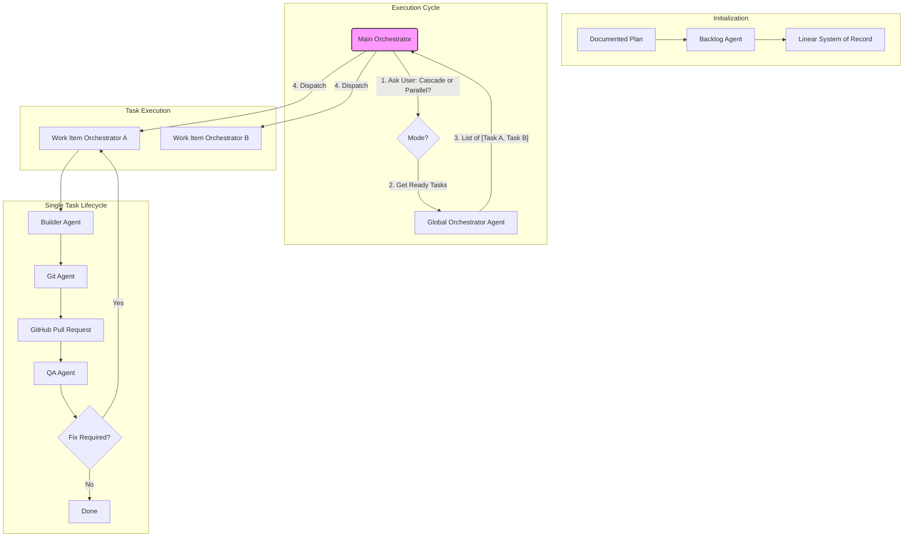
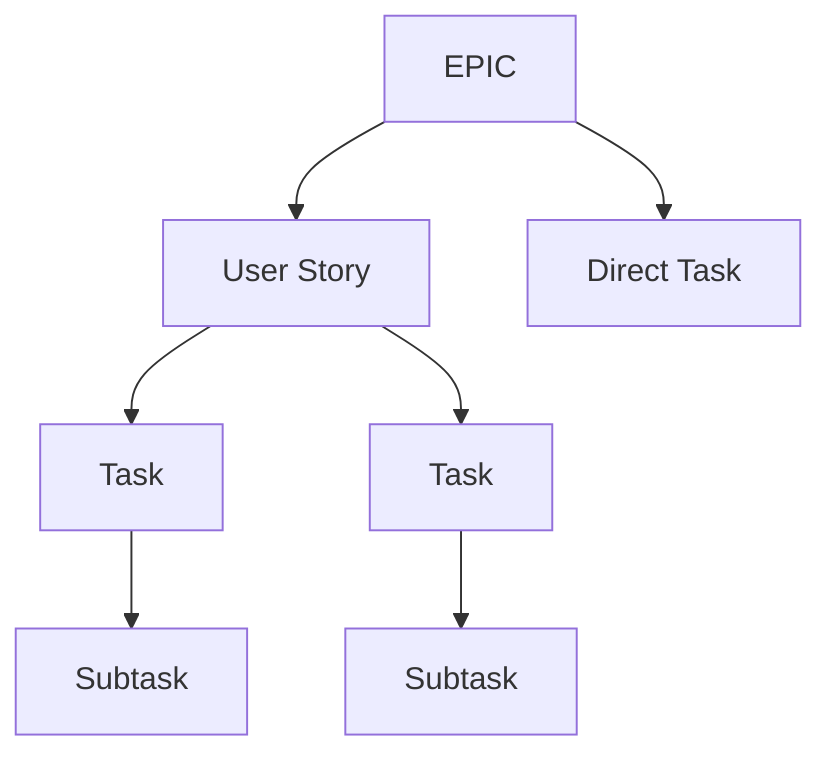
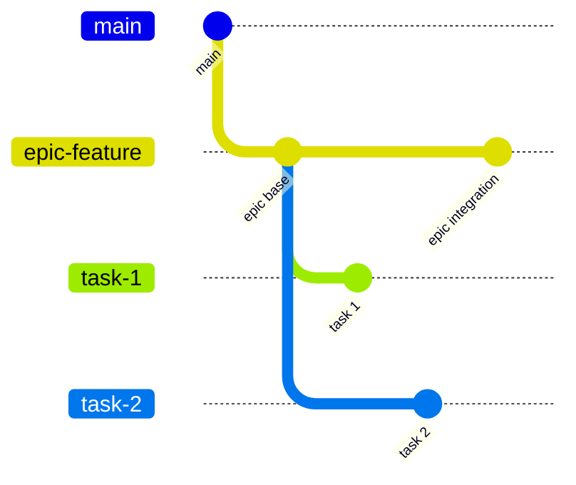
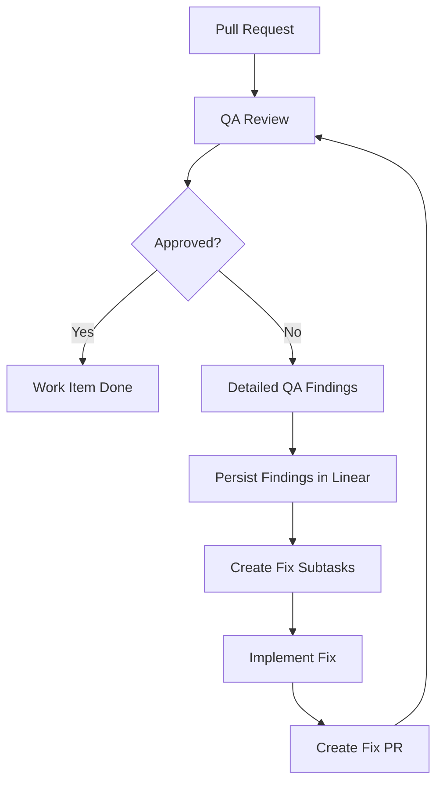
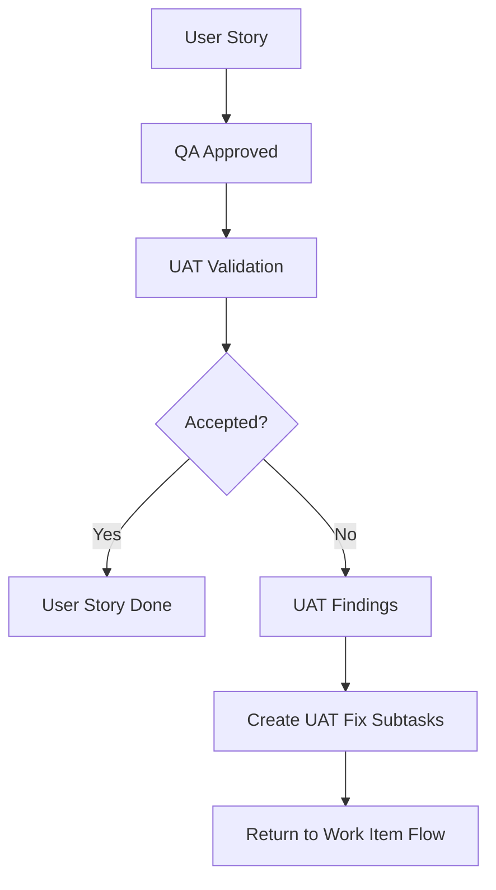
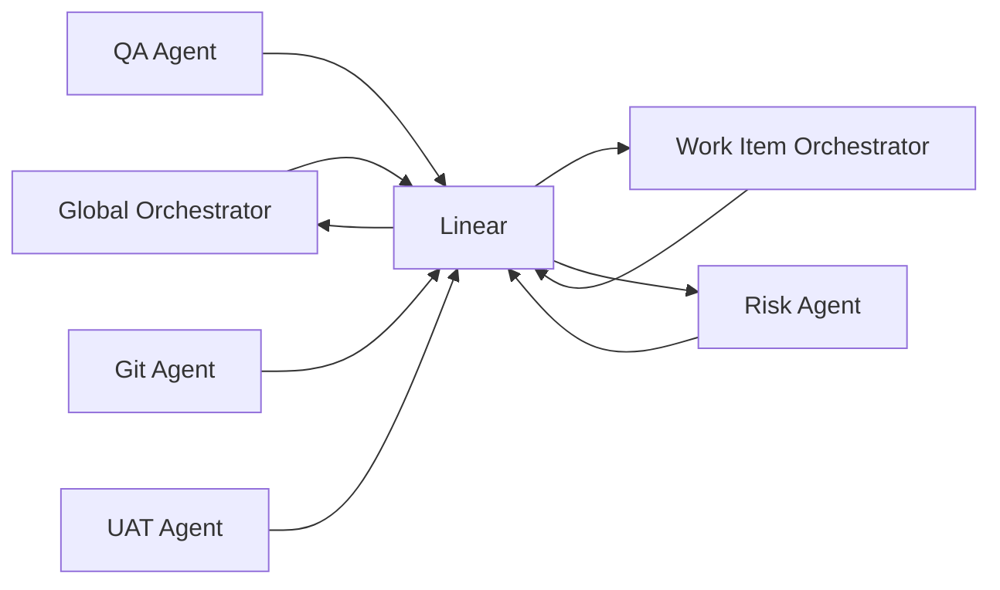
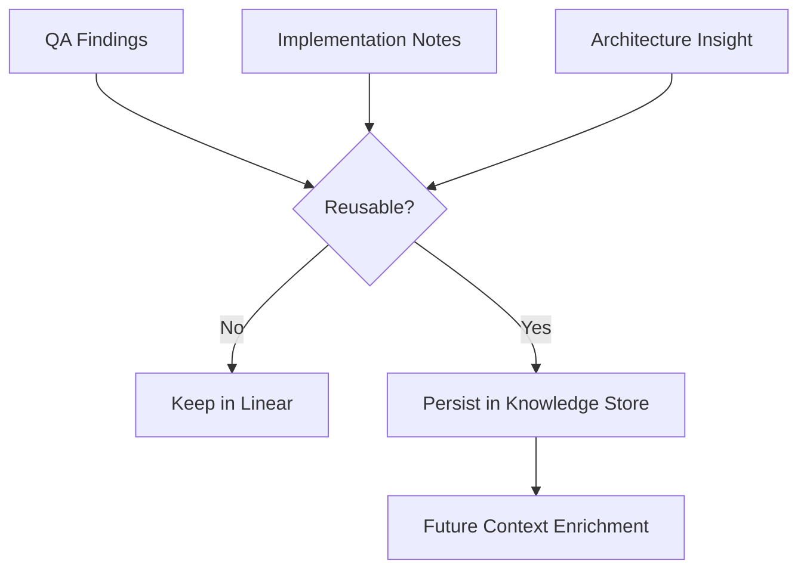
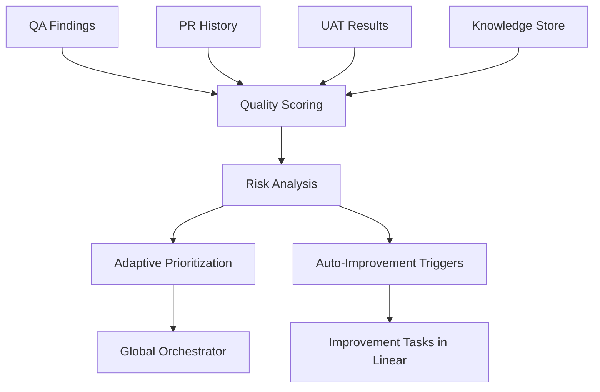
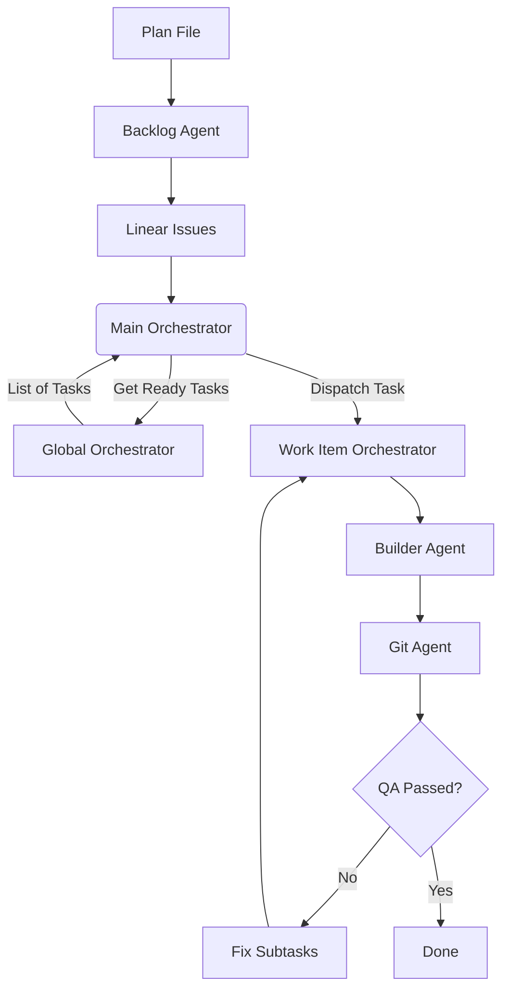
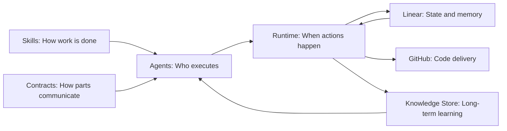

# HSBTech AI Engineering Workflow

## Overview

HSBTech is an AI-assisted engineering workflow designed to transform a documented plan into a structured, traceable, and quality-controlled software delivery process.

The system is built around the idea that AI agents should not behave like isolated assistants. Instead, they should operate as a coordinated engineering system with:

- clear responsibilities
- explicit contracts
- persistent state
- small execution steps
- strong QA loops
- traceable delivery through Linear and GitHub

The goal is to create a practical agentic workflow that can run on tools such as Claude Code, Codex, MCP-enabled runtimes, GitHub, and Linear.

---

## What This System Does

At a high level, HSBTech takes a documented plan and turns it into a complete engineering execution flow:

```txt
Plan
  → Backlog
  → Linear
  → Implementation
  → Pull Request
  → QA Review
  → Fix Loop
  → UAT
  → Epic Completion
```

The system is designed to support:

- backlog creation from a plan
- EPIC-driven delivery
- User Stories with UAT
- technical Tasks and Subtasks
- small Pull Requests
- stacked PR workflows
- QA findings converted into fix subtasks
- Linear as the operational system of record
- knowledge capture and reuse
- risk analysis and adaptive prioritization

---

## Core Philosophy

The system follows four core principles.

### 1. Linear is the System of Record

Linear is not just a tracker. It is the operational brain of the workflow.

It stores:

- EPICs
- User Stories
- Tasks
- Subtasks
- statuses
- dependencies
- PR links
- QA findings
- UAT results
- blockers
- execution memory

If something affects the current workflow, it must be represented in Linear.

---

### 2. Skills Define Behavior

Skills are reusable operational instructions.

They define how a specific type of work must be performed, such as:

- backlog planning
- implementation
- QA review
- PR management
- orchestration
- UAT validation
- knowledge enrichment

Skills are not tied to a specific tool. They can be used by Claude Code, Codex, local scripts, or other runtimes.

---

### 3. Agents Execute Skills

Agents are executable actors.

An agent owns a responsibility and uses one or more skills to perform work.

Example:

- Backlog Agent uses Backlog Planning
- Builder Agent uses Implementation
- QA Agent uses QA Review
- Git Agent uses Git/PR Management
- **Main Orchestrator Agent** is the entry point, deciding between sequential and parallel execution.
- **Global Orchestrator Agent** identifies what tasks can be run.

---

### 4. Multi-Level Orchestration

The system is not a single loop but a hierarchy of orchestrators, providing both flexibility and control.

1.  **Main Orchestrator**: The entry point. It decides the *how* (sequentially or in parallel).
2.  **Global Orchestrator**: The strategist. It determines the *what* (which tasks are ready to run).
3.  **Work Item Orchestrator**: The executor. It manages the lifecycle of a *single* task from start to finish.

This separation of concerns keeps the system:

- observable
- debuggable
- interruptible
- safe
- easy to reason about

---

# System Architecture



---

# Main Components

## 1. Skills

Skills are documented procedures used by agents.

Current skills:

| File | Purpose |
|---|---|
| `skills/00-MAIN-ORCHESTRATOR.md` | **(Entry Point)** Decides execution mode (Cascade/Parallel) and dispatches tasks. |
| `skills/07-GLOBAL-ORCHESTRATION.md` | **(Strategist)** Identifies and lists all ready-to-execute tasks for the Main Orchestrator. |
| `skills/06-TASK-ORCHESTRATION.md` | **(Executor)** Drives the lifecycle of a **single** work item as a sub-agent. |
| `skills/01-BACKLOG-PLANNING.md` | Converts a documented plan into EPICs, User Stories, Tasks, and Subtasks |
| `skills/02-IMPLEMENTATION.md` | Implements a selected work item without managing PRs or Linear state |
| `skills/03-QA-REVIEW.md` | Reviews PRs and generates detailed actionable findings |
| `skills/04-GIT-PR-MANAGEMENT.md` | Creates branches, commits, and stacked PRs |
| `skills/05-LINEAR-SYSTEM-OF-RECORD.md` | Manages Linear as operational state and memory |
| `skills/08-UAT-VALIDATION.md` | Validates User Stories from a user acceptance perspective |
| `skills/09-OBSERVABILITY-REPORTING.md` | Produces operational reports and visibility |
| `skills/10-KNOWLEDGE-CONTEXT-ENRICHMENT.md` | Enriches work with reusable technical context |
| `skills/11-KNOWLEDGE-STORAGE.md` | Persists long-term reusable knowledge |
| `skills/12-QUALITY-SCORING-RISK-ANALYSIS.md` | Measures quality and risk |
| `skills/13-ADAPTIVE-PRIORITIZATION.md` | Reorders work based on risk and real system state |
| `skills/14-AUTO-IMPROVEMENT-TRIGGERS.md` | Detects repeated issues and suggests improvement work |

Future enhancements are captured in:

| File | Purpose |
|---|---|
| `docs/FUTURE-SCOPE.md` | Documents future improvements and maturity layers |

---

## 2. Agent Contracts

`agents/AGENT-CONTRACTS.md` defines how agents and skills communicate.

It includes:

- shared state model
- runtime execution envelope
- error contract
- input/output schemas
- handoff contracts
- cross-agent interaction rules

The contract layer is what prevents agents from becoming chaotic or incompatible.

---

## 3. Agents

`agents/AGENTS.md` defines the executable actors of the system.

Current agents:

| Agent | Responsibility |
|---|---|
| Main Orchestrator Agent | **NEW:** Top-level orchestrator, chooses execution mode. |
| Global Orchestrator Agent | Identifies all executable tasks for the Main Orchestrator. |
| Work Item Orchestrator Agent | Drives one item through its lifecycle |
| Backlog Agent | Builds backlog from a plan |
| Linear Agent | Reads/writes operational state in Linear |
| Builder Agent | Implements code |
| Git Agent | Creates branches, commits, and PRs |
| QA Agent | Reviews PRs and produces findings |
| UAT Agent | Validates User Stories |
| Intelligence Agent | Enriches context and persists knowledge |
| Risk Agent | Scores quality/risk and prioritizes work |

---


---

# Backlog Model

The backlog starts from EPICs.



## EPIC

An EPIC is a deliverable feature or meaningful slice of the project.

It has:

- scope
- objective
- traceability to the plan
- related User Stories
- related Tasks
- final EPIC PR

The merge to main is always manual and happens from the EPIC PR.

---

## User Story

A User Story represents user-visible value.

It should have:

- persona
- action
- benefit
- acceptance criteria
- UAT validation

Not every User Story needs Tasks. If it is simple enough, it can be implemented directly.

---

## Task

A Task is usually a technical unit of work.

It can be linked to:

- a User Story
- directly to an EPIC

A Task without a User Story is allowed, especially when the work is:

- technical
- internal
- simple
- infrastructure-related
- refactoring-related

If a direct Task becomes too complex or delivers visible value, it should probably become a User Story or be decomposed.

---

## Subtask

A Subtask is the smallest actionable work unit.

Subtasks are especially useful for:

- QA fixes
- UAT fixes
- small implementation slices
- technical decomposition

---

# Backlog Flexibility Rules

The system is flexible, but not loose.

```txt
EPIC is mandatory.
User Story is recommended for user-visible value.
Task is flexible.
Subtask is used for precise execution or fixes.
```

Valid structures:

```txt
EPIC → User Story → Task → Subtask
EPIC → User Story
EPIC → Task
EPIC → Task → Subtask
```

Invalid structure:

```txt
Task without EPIC
Subtask without parent
User Story without traceability
```

---

# Pull Request Strategy

The system uses stacked PRs.



Conceptually:

```txt
main
  └── epic/<feature>
        ├── feature/LIN-101-task-1
        ├── feature/LIN-102-task-2
        └── feature/LIN-103-task-3
```

Rules:

- one task should produce one small PR
- task PRs target the proper EPIC branch or previous PR branch
- fix PRs target the original task PR when appropriate
- no agent merges to main
- EPIC PR is merged manually

---

# Runtime Flow

The overall workflow is best understood through the main **System Architecture** diagram presented earlier. It illustrates the new, flexible orchestration model:

1.  The **Main Orchestrator** starts the process, determining the execution mode (Cascade or Parallel).
2.  It consults the **Global Orchestrator** to get a list of all tasks that are ready to be worked on.
3.  It then dispatches these tasks to one or more **Work Item Orchestrators**.
4.  Each **Work Item Orchestrator** is a sub-agent responsible for the lifecycle of a single task, invoking other specialized agents like the `Builder`, `Git`, and `QA` agents as needed.

---

## QA Failure Loop



---

## UAT Flow



---

# Linear as the Brain

Linear stores operational state.



Linear should contain:

- EPIC hierarchy
- issue status
- QA status
- UAT status
- dependencies
- PR links
- comments
- findings
- blockers
- decisions

---

# Knowledge Store

Linear stores operational memory.

The Knowledge Store stores reusable long-term intelligence.



## Store in Linear when:

- it affects current workflow
- it belongs to an issue
- it represents execution state
- it is needed for traceability

## Store in Knowledge Storage when:

- it is reusable
- it represents a pattern
- it helps future implementation
- it helps future QA
- it identifies recurring risk
- it documents architectural insight

---

# Quality and Risk Layer

The system does not only execute work. It also learns from work.



The quality layer helps answer:

- Which EPIC is risky?
- Which module is fragile?
- Which task is causing rework?
- Which fixes should be prioritized?
- Which improvements should be proposed?

---

# Execution Modes & Triggers

The system's execution is defined by two concepts: **Execution Mode** (decided by the `Main Orchestrator`) and **Trigger** (how a cycle is initiated).

### Execution Modes

1.  **Cascade Mode (Sequential)**: The `Main Orchestrator` executes one task at a time. This is ideal for workflows requiring careful observation or where tasks might have subtle, undeclared dependencies.
2.  **Parallel Mode**: The `Main Orchestrator` executes all non-dependent tasks simultaneously. This is ideal for maximizing throughput and speed.

### Trigger Mechanisms

1.  **Manual Trigger**: A human initiates a run cycle by invoking the `Main Orchestrator` and choosing an execution mode. This is the default for the MVP.
2.  **CLI Loop Trigger**: A script (`run_loop.py`) runs the `Main Orchestrator` in a continuous loop, allowing for unattended execution.
3.  **Event-Driven Trigger (Future)**: A webhook (e.g., from Linear or GitHub) could trigger the `Main Orchestrator`, enabling a fully automated, event-based system.

---

# MVP Recommendation

Start small.

The first goal should not be full autonomy.

The first goal should be to complete one full controlled cycle:

```txt
1 EPIC
  → 2 or 3 Tasks
  → 1 implementation
  → 1 PR
  → 1 QA review
  → 1 fix
  → done
```

If this works, the system is viable.

---

# Minimal MVP Flow



---

# Suggested Repository Structure

```txt
hsbtech/
  README.md

  docs/
    plan.md

  skills/
    01-BACKLOG-PLANNING.md
    02-IMPLEMENTATION.md
    03-QA-REVIEW.md
    04-GIT-PR-MANAGEMENT.md
    05-LINEAR-SYSTEM-OF-RECORD.md
    06-TASK-ORCHESTRATION.md
    07-GLOBAL-ORCHESTRATION.md
    08-UAT-VALIDATION.md
    09-OBSERVABILITY-REPORTING.md
    10-KNOWLEDGE-CONTEXT-ENRICHMENT.md
    11-KNOWLEDGE-STORAGE.md
    12-QUALITY-SCORING-RISK-ANALYSIS.md
    13-ADAPTIVE-PRIORITIZATION.md
    14-AUTO-IMPROVEMENT-TRIGGERS.md

  agents/
    AGENTS.md
    AGENT-CONTRACTS.md

  runtime/
    RUNTIME-EXECUTION.md
    run_loop.py

  knowledge/
    architecture/
    qa/
    implementation/
    backlog/
```

---

# Operational Safety Rules

## 1. No Automatic Merge

No agent merges into `main`.

EPIC PR merge is always manual.

---

## 2. Controlled Execution Scope

- In **Cascade Mode**, the system executes one action for one task at a time.
- In **Parallel Mode**, the system executes one action for *each* concurrent task, but each task's lifecycle is still managed independently and sequentially.

---

## 3. Linear First

Every orchestration cycle starts by reading Linear.

---

## 4. QA Cannot Be Skipped

Every PR must pass QA before completion.

---

## 5. UAT Validates Product Behavior

QA validates implementation quality.

UAT validates whether the feature solves the user need.

---

## 6. No Hidden Durable State

Durable operational state goes to Linear.

Reusable intelligence goes to Knowledge Storage.

---

## 7. Scope Must Stay Small

Agents should not expand scope silently.

If the work grows, create another work item.

---

# Example End-to-End Narrative Flow

1.  A **Human** provides a `plan.md` file.
2.  The **Main Orchestrator** starts. It invokes the **Global Orchestrator**.
3.  The **Global Orchestrator** sees that no backlog exists in Linear and delegates to the **Backlog Agent**.
4.  The **Backlog Agent** reads the plan and creates EPICs/Tasks, which are persisted by the **Linear Agent**.
5.  On the next cycle, the **Main Orchestrator** asks the user for the execution mode (e.g., `Parallel`).
6.  It asks the **Global Orchestrator** for ready tasks. The **Global Orchestrator** returns a list of all non-dependent tasks: `[Task_A, Task_B]`.
7.  The **Main Orchestrator**, being in `Parallel` mode, dispatches two **Work Item Orchestrators** concurrently, one for `Task_A` and one for `Task_B`.
8.  Each **Work Item Orchestrator** then manages its task's lifecycle: invoking the `Builder Agent` to write code, the `Git Agent` to create a PR, and the `QA Agent` for review.
9.  If QA fails, a fix sub-task is created and the cycle repeats for that item.
10. Once all tasks and sub-tasks are `Done`, the EPIC is marked as ready for manual merge.

---

# How to Think About the System

This is not a single agent.

It is closer to an AI-powered engineering operating system.

```txt
Linear = memory and operational truth
Skills = procedures
Contracts = interfaces
Agents = workers
Runtime = execution loop
GitHub = delivery surface
Knowledge Store = long-term learning
```

---

# Why This Design Matters

Without this structure, agentic engineering usually becomes:

- unclear
- hard to debug
- unsafe
- too broad
- inconsistent
- impossible to scale

With this structure, each part has a clear role:

- Backlog is structured.
- Execution is scoped.
- PRs are traceable.
- QA is actionable.
- Fixes become work items.
- Linear preserves state.
- Knowledge is reused.
- Orchestration stays deterministic.

---

# Final Mental Model



---

## Final Rule

> Make every action small, traceable, reviewable, and recoverable.
