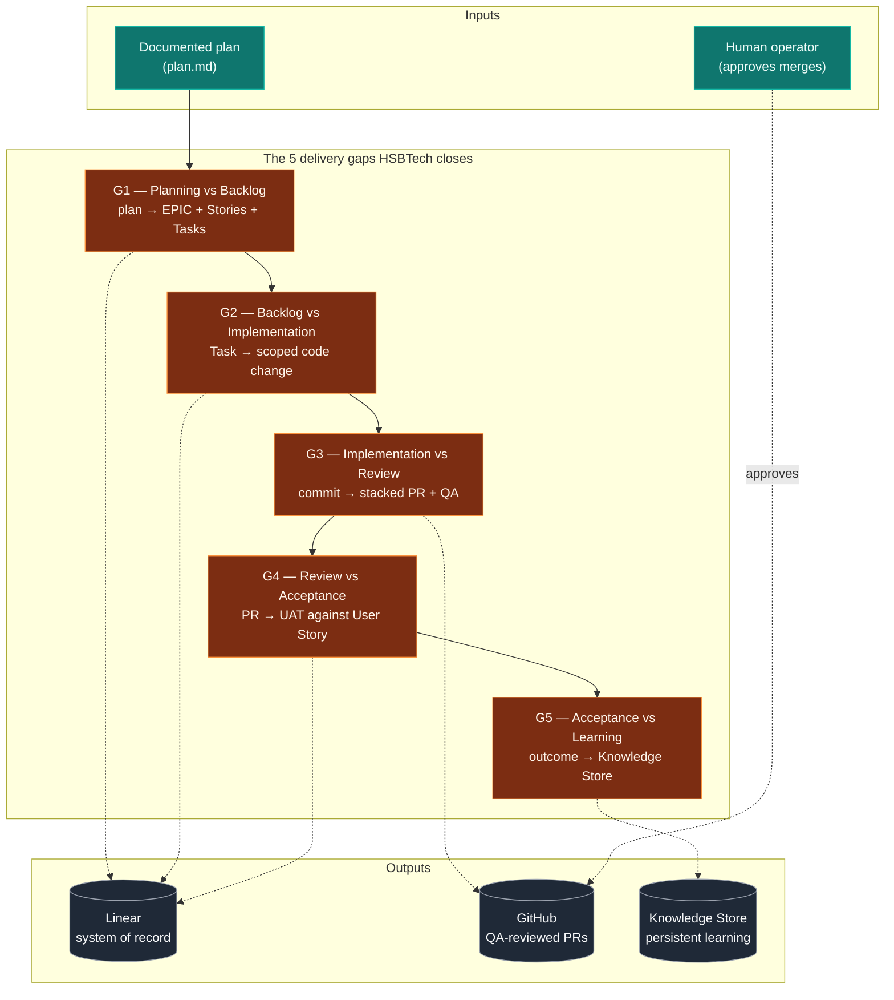
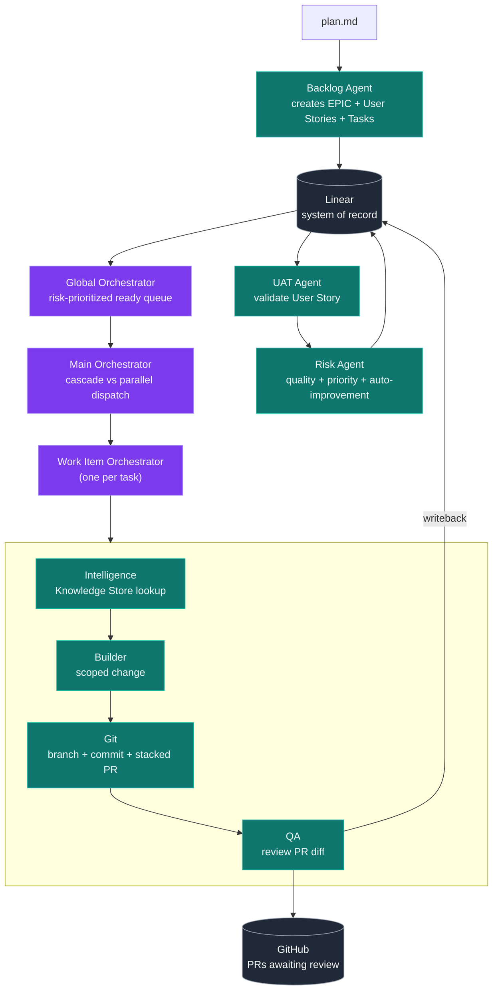
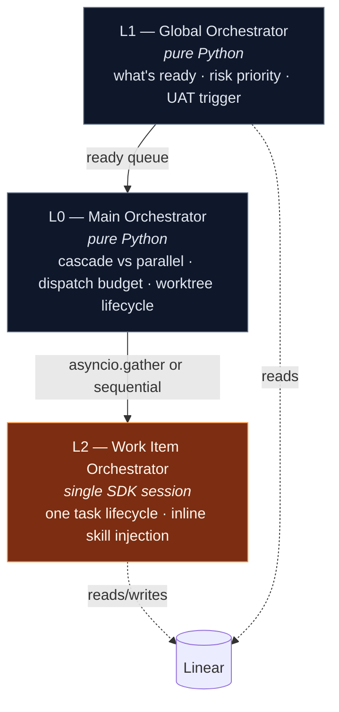
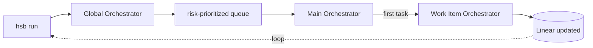
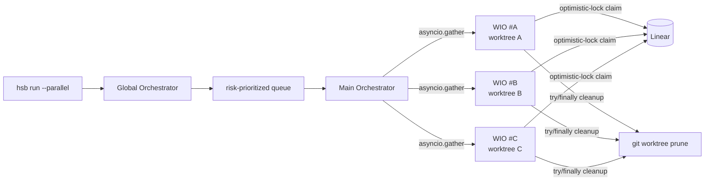
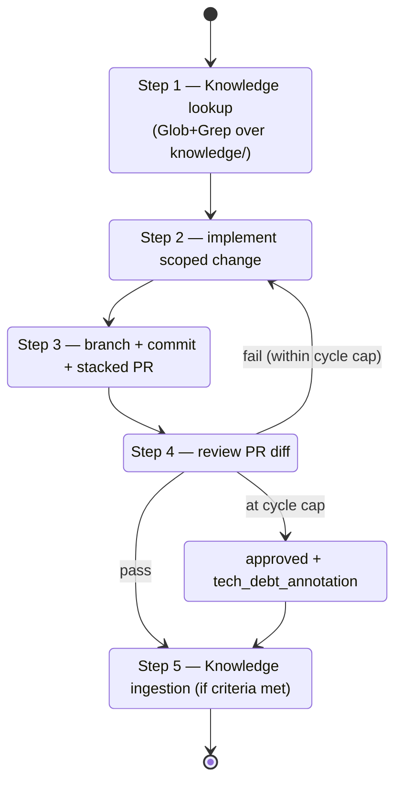
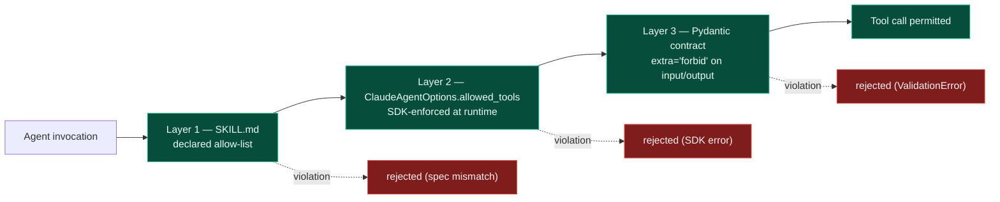

# HSBTech — AI Engineering Workflow

[](https://www.python.org/)
[](https://docs.anthropic.com/)
[](https://platform.openai.com/)
[](https://linear.app/)
[](https://github.com/)

> A coordinated multi-agent system that turns a documented plan into traceable, QA-reviewed software delivery via Linear and GitHub. Built on the Claude Agent SDK (with an alternate Codex SDK runtime) under structurally-enforced capability boundaries and a deterministic, risk-based prioritizer.

---

## Table of contents

1. [Get started](#get-started)
2. [The problem we solve](#the-problem-we-solve)
3. [Business value](#business-value)
4. [What this is](#what-this-is)
5. [How it works](#how-it-works)
6. [The agents](#the-agents)
7. [Operating modes](#operating-modes)
8. [Work Item Orchestrator lifecycle](#work-item-orchestrator-lifecycle)
9. [Guardrails](#guardrails)
10. [Capability-boundary defense](#capability-boundary-defense)
11. [Dependencies (and why pinning matters)](#dependencies-and-why-pinning-matters)
12. [CLI reference](#cli-reference)
13. [Knowledge Store](#knowledge-store)
14. [Test suite](#test-suite)
15. [Design rules and constraints](#design-rules-and-constraints)
16. [License](#license)

---

## Get started

**New operator?** Start with [**GET-STARTED.md**](./GET-STARTED.md) — clone-to-first-cycle in ~30 minutes, covers OAuth2 token setup, Linear MCP browser flow, sandbox issue setup, and the `hsb-test-fixture` GitHub repo.

```bash
git clone <repo-url> hsb && cd hsb
python3.12 -m venv .venv && source .venv/bin/activate
pip install -e ".[dev]"
hsb --help                       # confirms Typer CLI is registered
```

Then jump to:

- [**GET-STARTED.md**](./GET-STARTED.md) — first cycle, troubleshooting, common workflows.
- [Dependencies](#dependencies-and-why-pinning-matters) — what's pinned, what's optional, and why.
- [CLI reference](#cli-reference) — the `hsb` command surface.

---

## The problem we solve

Software delivery breaks at the seams — between planning and execution, between code and review, between "done" and "shipped." The wider the seam, the more context is lost, the more decisions go unrecorded, and the more rework piles up. AI agents that generate code in isolation widen those seams further: they produce output but not traceability.

HSBTech closes the loop. A documented plan goes in; QA-reviewed PRs, auditable Linear comments, and structured Knowledge Store entries come out. Every decision is captured where humans already work (Linear), every change lands where engineers already review (GitHub PRs), and every agent action is bounded by structural capability guardrails — not aspirational prose.



Each gap maps to a dedicated agent or orchestrator with a single responsibility, a declared allow-list, and a Pydantic input/output contract. Nothing leaks across gaps without a recorded transition.

---

## Business value

| Stakeholder | Pain today | What HSBTech changes |
|-------------|------------|----------------------|
| **Engineering lead** | Planning artifacts and delivered code drift apart; no audit trail from "decision" to "merge." | Every Linear task carries a stacked PR, QA findings, and a knowledge entry. Decisions live next to evidence. |
| **Senior engineer** | Reviewing AI-generated PRs is slower than reviewing humans — no context on *why*. | QA Agent reviews the diff against acceptance criteria *before* a human sees it. Humans approve, they don't triage. |
| **Tech lead / Architect** | Hard to enforce capability boundaries on autonomous agents — drift happens silently. | Capability boundaries are structural (SKILL.md + `allowed_tools` + Pydantic `extra="forbid"`). A regression in one layer is caught by the other two. |
| **PM / Delivery** | "Where is task X?" requires Slack archaeology. | Linear is the only durable operational state. `hsb show-state` renders the live view. |
| **Compliance / Security** | Agents that touch production credentials are unauditable. | OAuth2 only — `ANTHROPIC_API_KEY` is refused at startup (G1). Risk Agent is structurally air-gapped from Linear writes (RISK-04). |
| **The next engineer to join** | Knowledge dies in Slack threads and closed PRs. | Knowledge Store persists patterns, anti-patterns, and recurring QA findings. Validated by Pydantic; rejects "n/a" / "all tasks" / "tbd" applicability. |

The system is opinionated about *where* state lives: **Linear for operational state, GitHub for code, the Knowledge Store for reusable patterns, nothing else.** This is what makes it auditable.

---

## What this is

HSBTech turns a documented plan into a complete engineering execution flow. Linear is the durable system of record; GitHub is the code-delivery surface. Every merge to `main` is human-approved. Every agent action is structured JSON in / JSON out, traceable by Linear comment and Git commit.



The runtime is the Claude Agent SDK (with an alternate Codex SDK pathway). Every agent fits one of three patterns: a stateful `ClaudeSDKClient` session (Work Item Orchestrator), a one-shot `query()` session (UAT, Risk auto-improvement skill), or a pure-Python class (Risk scoring, Global Orchestrator, Main Orchestrator).

---

## How it works

Three orchestration levels, deliberately separated by responsibility:



| Level | Class | Decides | Runtime pattern |
|-------|-------|---------|-----------------|
| **L0 — Main** | `MainOrchestrator` | Cascade vs parallel · dispatch budget · worktree lifecycle | Pure Python (deterministic) |
| **L1 — Global** | `GlobalOrchestrator` | What's ready (no blocking deps) · risk priority · UAT readiness | Pure Python (deterministic) |
| **L2 — Work Item** | `WorkItemOrchestrator` | The full lifecycle of one task — Builder → Git → QA → fix loop | Single SDK session (LLM, bounded) |

L0 and L1 are deterministic. L2 is the only place LLM reasoning drives a multi-step lifecycle, and it is bounded: capped QA cycles per task, structurally-enforced no-sub-subagent dispatch, no `Agent` tool in `allowed_tools`. The same Work Item Orchestrator runs in cascade and parallel — the only difference is whether `MainOrchestrator` invokes one at a time or via `asyncio.gather` with worktree isolation.

---

## The agents

Skills (behavioral specs injected as system prompts) live under `.claude/skills/`. Pydantic input/output contracts live under `src/hsb/contracts/`. Agent implementations live under `src/hsb/agents/`.

| Agent | Role | Capability stance | Runtime pattern |
|-------|------|-------------------|-----------------|
| **Linear Agent** | All Linear MCP I/O. Provides `run_linear_agent` and `run_validated_linear_agent` (Pydantic-gated retry self-correction). Implements optimistic-lock procedure (read `updatedAt` → write → re-read → verify). | Linear MCP only; `linear_write_guard` denies callers from `risk_agent.py`. | One-shot `query()` |
| **Backlog Agent** | Reads `plan.md`, produces `BacklogOutput` (EPIC + User Stories + Tasks + Subtasks). Idempotent on rerun. | Allow-list: Linear `create_issue`, `list_issues`, `get_issue`, `Read`. | One-shot `query()` |
| **Builder Agent** | Implements only the scoped change for one Task. | Allow-list: filesystem + bounded `Bash` for test/lint/typecheck. **No** `mcp_servers`, **no** git, **no** Linear. | One-shot `query()` |
| **Git Agent** | Branch `feature/LIN-{id}-{slug}`, commit, open stacked PR (Task PRs target `epic/LIN-...`, never `main`). Owns `REBASE_STACK` for sibling PRs. | Allow-list: `gh pr create/view/diff`, `git push --force-with-lease`. **No** `Edit`, **no** `Write`, **no** `git merge`, **no** `gh pr merge`, **no** `mcp__linear__*`. | One-shot `query()` |
| **QA Agent** | Reviews PR diff against requirements. Emits findings or approves. | Allow-list: `Read`, `gh pr diff`, `gh pr view`. Triple-layer cycle cap (system prompt + Pydantic `model_validator` + integration test). | One-shot `query()` |
| **Work Item Orchestrator** | Drives one Linear task end-to-end (Intelligence → Builder → Git → QA → fix loop). Inline skill injection. | No sub-subagent dispatch: `agents=` kwarg absent, `AgentDefinition` not imported, runtime backstop in every receive loop. | Stateful `ClaudeSDKClient` |
| **Global Orchestrator** | Reads Linear state, filters dependency-blocked tasks, calls `RiskAgent.get_priority_queue()`, detects UAT-ready User Stories, dispatches UAT inline. | Pure Python, no SDK session, no LLM. | Pure Python async |
| **Main Orchestrator** | Dispatch controller. Cascade runs WIOs sequentially. Parallel uses `asyncio.gather(..., return_exceptions=True)` with optimistic-lock claiming + worktree isolation + `try/finally` cleanup + startup `git worktree prune`. | Subprocess env is a strict allowlist (no `**os.environ`). | Pure Python async |
| **Intelligence Agent** | Embedded inline in the WIO via the knowledge skills. Pre-Builder: queries Knowledge Store via Glob+Grep, populates `knowledge_context`. Post-QA: evaluates findings, writes a new entry if ingestion criteria are met. | `KnowledgeStorageInput` rejects `applicability` of "all tasks" / "n/a" / "tbd" / empty. | Inline (no separate process) |
| **UAT Agent** | Validates User Story acceptance criteria. Produces scenario pass/fail with evidence. | Allow-list: `Read`, `Glob`, `Grep`, `Bash`. **No** `Write`, **no** `Edit`, **no** `Agent`, **no** Linear MCP. `mcp_servers=None`. SCOPE BOUNDARY literal in every prompt. | One-shot `query()` |
| **Risk Agent** | Deterministic quality scoring + adaptive prioritization (pure Python). Auto-improvement-trigger detection runs as an isolated SDK call (`allowed_tools=[]`, `mcp_servers=None`, Haiku, tight `max_turns` and budget). | Never writes to Linear directly — multiple structural defenses including no `linear_agent` import, `linear_write_guard`, and a `Literal["suggested"]` Pydantic field. | Pure Python + isolated `query()` |

### Sentinel module

`_sdk_options.py` is the chokepoint that enforces the SDK guardrails structurally. Every SDK call site routes through `make_options()`, which calls `assert_oauth2_only()` and refuses any `allowed_tools` containing `"Agent"`. It also exports `assert_no_task_dispatch(msg)` (the runtime backstop) and `linear_write_guard` (the stack-inspection decorator on Phase 1 Linear write methods).

---

## Operating modes

### Cascade (default)



Ideal for: development, debugging, single-developer workflows, MVP usage. Run `python run_loop.py` to repeat until the backlog is empty or `Ctrl+C`.

### Parallel



Ideal for: throughput, multi-task parallelism on independent EPICs, post-MVP scale. Optimistic-lock claiming via `updatedAt` re-read prevents double-claims. Each WIO runs in its own `.worktrees/<task-slug>` git worktree, cleaned up in `try/finally`. The parallel acceptance gate verifies correctness against a real Linear test workspace.

---

## Work Item Orchestrator lifecycle

A single Claude Agent SDK session driving one Linear task through its full lifecycle. The fix loop is bounded by a cycle cap; on the final cycle, QA must approve with a `tech_debt_annotation`.



Skills concatenated into the system prompt at startup include task orchestration plus the four execution skills (backlog/implementation/git/QA), plus the two knowledge skills. The session has **no** sub-subagent dispatch — `agents=` kwarg absent, `AgentDefinition` not imported, runtime backstop in every receive loop.

---

## Guardrails

Stable invariant IDs with structural enforcement. The mechanism column points at the chokepoint that makes each guardrail load-bearing rather than aspirational.

| ID | What it enforces | Mechanism |
|----|------------------|-----------|
| **G1** | OAuth2-only — no API keys | `assert_oauth2_only()` function-entry guard + `_gsd_clear_api_key` autouse session fixture |
| **G2** | No `Agent` tool in `allowed_tools` (no sub-subagent dispatch) | `make_options()` factory raises `ValueError` |
| **G3** | Runtime backstop for G2 — catches SDK regressions | `assert_no_task_dispatch(msg)` in every receive loop |
| **G4** | Risk Agent auto-improvement is structurally air-gapped | `allowed_tools=[]`, `mcp_servers=None`, Haiku, tight `max_turns` + `max_budget_usd` |
| **G5** | Linear writes denied for callers from `risk_agent.py` (except via explicit delegated path) | `linear_write_guard` stack-inspection decorator |
| **G6** | UAT cycle cap is a project-wide invariant | Global Orchestrator skips re-dispatch + posts escalation comment (camelCase `issueId`, `body`) |
| **G7** | `error_max_turns` raises `RuntimeError` — no silent loop continuation | `if msg.stop_reason == "error_max_turns": raise` in every SDK loop |
| **G8** | WIO context-budget warning at the configured input-token threshold | WARN log emitted in receive loops |
| **G9** | Knowledge Store pre-write hook | `KnowledgeStorageInput.applicability` validator + `extra="forbid"` |
| **G10** | UAT pre-persist validation (UAT coverage + banned-token regex) | `_uat_passes_g10` helper called twice in `get_ready_tasks` |

The **RISK-04** invariant (Risk Agent never writes to Linear directly) has multiple layers of structural defense: no `linear_agent` import in `risk_agent.py`, the `linear_write_guard` decorator, a `Literal["suggested"]` Pydantic field, and `allowed_tools=[]` on the auto-improvement skill.

---

## Capability-boundary defense

Every agent is sandboxed by three independent layers. A regression in one layer does not breach the boundary because the other two still hold.



| Layer | What it catches |
|-------|-----------------|
| SKILL.md allow-list | Drift between declared and actual capability |
| `ClaudeAgentOptions.allowed_tools` | Runtime tool calls outside the allow-list |
| Pydantic `extra="forbid"` | Schema drift in agent input/output (FOUND-03) |

Cross-cutting checks (the `_sdk_options.py` chokepoint, `linear_write_guard`, `assert_no_task_dispatch`) sit on top of these layers.

---

## Dependencies (and why pinning matters)

HSBTech runs against external systems whose contracts change underneath us — the Claude Agent SDK, the Codex SDK, the Linear MCP, the GitHub CLI. **A single unpinned upgrade can silently breach a guardrail** (e.g., an SDK update that quietly allows `Agent` in `allowed_tools` would defeat G2 at the source). Every dependency below is pinned with a documented role; treat upgrades as planned work, not background maintenance.

### Required runtime

| Dependency | Pin | Role | Risk if it drifts |
|------------|-----|------|-------------------|
| **Python** | `>=3.12` | Runtime — `match`/`PEP 695` features used in contracts | Type-narrowing regressions; pre-3.12 SDK incompatibility |
| **`claude-agent-sdk`** | `>=0.1.73, <0.2.0` | Primary LLM session orchestration; `ClaudeSDKClient`, `query()`, `ClaudeAgentOptions` | G1/G2/G3 chokepoints assume current option-builder semantics |
| **`openai-codex-sdk`** | `>=0.1.11` | Alternate runtime (`src/hsb/runtime/codex.py`) for the Codex OAuth pathway | Runtime feature parity loss; protocol shim drift |
| **`pydantic`** | `>=2.0` | Contract validation; FOUND-03 schema-drift defense via `extra="forbid"` | Silent schema acceptance → boundary breach (L3) |
| **`typer`** | `>=0.12` | CLI surface | CLIR-05 boundary (sync handlers, `asyncio.run` at body) may break under Click churn |
| **`rich`** | `>=13.0` | CLI rendering for `hsb show-state` and friends | Cosmetic only |
| **`python-dotenv`** | `>=1.0` | `.env` loading for local operator setup | Env propagation regressions across runs |

### Required external systems

| System | Role | Notes |
|--------|------|-------|
| **Linear MCP** (`mcp.linear.app/mcp`) | Durable system of record — the *only* persistent operational state besides the Knowledge Store | OAuth2 setup via the browser flow; see [GET-STARTED.md](./GET-STARTED.md). Optimistic locking via `updatedAt`. |
| **GitHub CLI (`gh`)** | PR delivery surface | `gh auth status` must be green. No `gh pr merge` exists in any allow-list — merges are human-approved. |
| **Anthropic OAuth2** | Claude Agent SDK runtime auth | `claude setup-token` + `CLAUDE_CODE_OAUTH_TOKEN`. `ANTHROPIC_API_KEY` is **refused** at startup (G1). |
| **OpenAI ChatGPT OAuth2** + **`@openai/codex` CLI** *(optional)* | Required only when flipping an agent to the Codex runtime via `HSB_RUNTIME_*=codex`. Quota consumed against the operator's ChatGPT seat (Plus / Pro / Business / Edu / Enterprise). | `codex login --device-auth` populates `~/.codex/auth.json`. `OPENAI_API_KEY` is **refused** at startup (extended G1). The WIO is **not flippable** — `HSB_RUNTIME_WIO=codex` raises. `LINEAR_HOOKS` do not run on the Codex path. |

### Dev extras (`pip install -e ".[dev]"`)

| Dependency | Pin | Role |
|------------|-----|------|
| `pytest` | `>=8.0` | Test framework |
| `pytest-asyncio` | `>=0.23` | Async test support |
| `hypothesis` | `>=6.100` | Property tests for the deterministic Risk formula (RISK-01) |
| `ruff` | `>=0.9` | Lint + format |
| `mypy` | `>=1.14` | Strict type-check (`strict = true` in `pyproject.toml`) |
| `pre-commit` | `>=4.0` | Hook orchestration |
| `jupyterlab` | `>=4.0` | Manual-inspection notebooks under `notebooks/` |

### Upgrade discipline

- **Treat SDK upgrades as breaking-by-default.** Run the full unit suite + the structural guardrail tests before adopting a new `claude-agent-sdk` minor version. The `<0.2.0` ceiling is intentional.
- **Linear MCP schema changes require a hooks audit.** `LINEAR_HOOKS` in `src/hsb/agents/hooks.py` is the retry/audit chokepoint — verify after any Linear API change.
- **GitHub CLI behavior changes propagate silently.** The Git Agent's allow-list assumes `gh pr create/view/diff` semantics; check the changelog when `gh` major-versions.
- **Knowledge Store has no schema migration tooling.** Adding a required field to `KnowledgeStorageInput` invalidates older entries — plan for a sweep.

---

## CLI reference

### Linear ops

```bash
hsb create-issue        # Create EPIC / User Story / Task / Subtask with parent linkage (LINR-01)
hsb update-issue        # Update status / qa_status / uat_status / assigned_orchestrator (LINR-02)
hsb add-comment         # Add structured comment (decision / QA finding / impl note) (LINR-03)
hsb link-pr             # Link GitHub PR URL to a Linear work item (LINR-04)
```

### Per-agent CLI subgroups

```bash
hsb backlog ...         # Backlog Agent commands
hsb builder ...         # Builder Agent commands
hsb git ...             # Git Agent commands (incl. `hsb git rebase-stack`)
hsb qa ...              # QA Agent commands
```

### Orchestration

```bash
hsb run-next-step       # Trigger ONE Work Item Orchestrator cycle (cascade default) — CLIR-01
hsb run                 # Drive cycles via Global + Main Orchestrators
hsb run --parallel      # Parallel mode: optimistic claiming + worktree isolation
hsb show-state          # Render Linear EPICs / tasks / QA / PR links — CLIR-02
hsb show-next-action    # Dry-run — show next decision without side effects — CLIR-03
```

### Continuous loop

```bash
python run_loop.py      # Repeats `hsb run` until backlog empty or Ctrl+C — CLIR-04
```

All CLI handlers wrap their async work in `asyncio.run()` at the Typer body — never inside coroutines (CLIR-05). State lives in Linear, not the CLI process.

---

## Knowledge Store

The Intelligence Agent's persistent state. Flat markdown + YAML frontmatter, file-based, no vector DB (per the ADVL-01 deferral).

Categories: architecture · qa · implementation · backlog · risk · patterns · anti-patterns.

Every entry is validated by the `KnowledgeStorageInput` Pydantic model. The `applicability` field rejects `"all tasks"`, `"n/a"`, `"tbd"`, and empty values (G9 — prevents Knowledge Store contamination, INTL-02 ingestion criteria). Required fields cover title, type, context, evidence (Linear issue ID + PR URL + files), insight, recommendation, applicability, and date.

Retrieval is Glob+Grep at MVP scale. If the store grows past the documented scaling threshold with degrading retrieval precision, `rank-bm25` is the documented upgrade path (no vector DB, no new framework dependency).

---

## Test suite

```bash
pytest tests/unit/ -x -q                    # unit tests
pytest tests/evals/code_based/ -x -q        # B1 UAT coverage + B3 banned-token regex
pytest -m integration                       # integration tests (skip without live env vars)
```

**Real-data integration testing stance.** Integration suites run against a real Linear workspace + the real `hsb-test-fixture` GitHub repo. No mocking. Tests skip cleanly without env vars via `_require_*` helpers. Operator setup pathway: see [GET-STARTED.md](./GET-STARTED.md).

**Property-based testing.** The Risk Agent quality score (RISK-01) uses `hypothesis @given` to verify determinism across the input space.

---

## Design rules and constraints

### Hard rules (architectural invariants)

1. **No automatic merge to `main`** — every EPIC PR merge is human-approved. There is no `gh pr merge` in any allow-list anywhere.
2. **One action per Work Item Orchestrator cycle** — prevents runaway automation. Enforced by the QA cycle cap and `error_max_turns` raises.
3. **No sub-subagent dispatch (WORC-02)** — the WIO is one SDK session. No nested sessions. Verified by AST walk + G2 + G3 backstop.
4. **OAuth2 only — no API keys (G1)** — `ANTHROPIC_API_KEY` is forbidden in process env. Use `claude setup-token` + `CLAUDE_CODE_OAUTH_TOKEN`.
5. **Linear is the only durable operational state** — agents read and write Linear; reusable patterns go to the Knowledge Store; nothing else persists across runs.
6. **Risk Agent never writes to Linear without explicit delegation (RISK-04)** — multiple structural-defense layers.
7. **Capability boundaries are structural, not docstring-level** — every agent has the three-layer defense: SKILL.md allow-list + `ClaudeAgentOptions.allowed_tools` + Pydantic `extra="forbid"`.

### Soft conventions (project style)

- All Pydantic models use `extra="forbid"` (FOUND-03 schema-drift defense).
- All CLI handlers are sync; `asyncio.run()` lives at the Typer body, never inside coroutines (CLIR-05 boundary).
- All cross-system regex constraints are Pydantic `Field(..., pattern=)` — `LIN-\d+`, `https://github.com/.+/pull/\d+`, etc.
- All Linear writes go through `run_validated_linear_agent` — not direct MCP calls.
- All retry/backoff is in PostToolUseFailure hooks (`LINEAR_HOOKS`), not in-prompt retry instructions.

### Out of scope (deferred)

- Event-driven triggers (Linear/GitHub webhooks) — current iteration uses CLI loop.
- Observability / tracing — no production tracing is currently wired in. Trace exports and dashboards are unimplemented; structured logging via stdlib is the only signal today.
- Multi-project / cross-project intelligence.
- Simulation / dry-run mode beyond `hsb show-next-action`.
- ML-based risk prediction (the current formula is deterministic by design).
- Semantic search over the Knowledge Store (ADVL-01).

---

## License

[Add license here — recommended: Apache-2.0 or MIT for an internal tooling project, or proprietary if not open-source]
