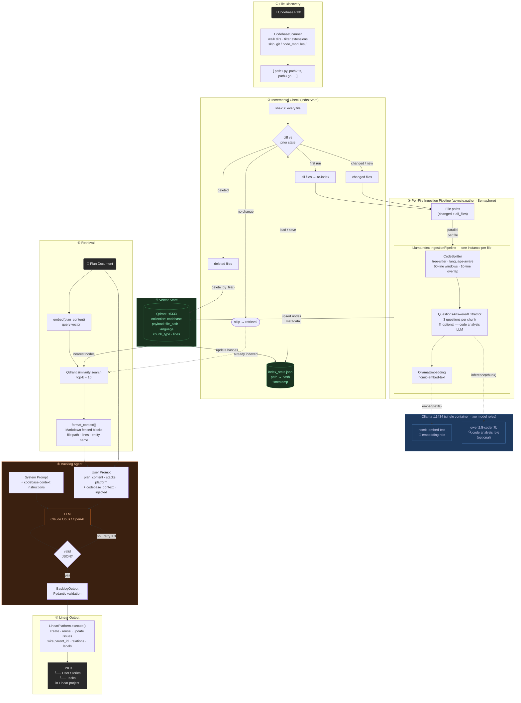

# Backlog Agent RAG — Implementation Plan

## End-to-End Flow Diagram



---

## Context

The backlog agent (and future agents) need contextual knowledge of the target codebase to produce
grounded, implementation-ready tasks. The solution is a shared `src/rag/` module that:

- Scans a codebase for parseable files
- Runs a **LlamaIndex ingestion pipeline** per file, in parallel
- Stores embeddings in **Qdrant** (Docker sidecar)
- Supports **incremental re-indexing** — detects file-hash changes on branch switches and only
  re-processes what changed
- Exposes a simple `CodebaseKnowledgeBase` façade usable by any agent

---

## Infrastructure Changes

### `docker-compose.yml` — add Ollama + Qdrant sidecars

```yaml
services:
  qdrant:
    image: qdrant/qdrant:latest
    container_name: hsb-qdrant
    ports:
      - "6333:6333"    # HTTP/REST — host-networked hsb reaches localhost:6333
      - "6334:6334"    # gRPC
    volumes:
      - hsb-qdrant-data:/qdrant/storage

  ollama:
    image: ollama/ollama:latest
    container_name: hsb-ollama
    ports:
      - "11434:11434"
    volumes:
      - hsb-ollama-models:/root/.ollama
    entrypoint: ["/bin/sh", "-c"]
    # One Ollama process serves ALL models via the same HTTP API on :11434.
    # Two distinct model roles:
    #   nomic-embed-text  — embedding (small, fast, ~270 MB)
    #   qwen2.5-coder:7b  — code analysis / metadata enrichment (~4.7 GB, optional)
    # The analysis model is only invoked when HSB_RAG_ANALYSIS_MODEL is set.
    # Pull both on first start; subsequent starts are no-ops (models cached in volume).
    command: >
      ollama serve &
      sleep 5 &&
      ollama pull nomic-embed-text &&
      if [ -n "$HSB_RAG_ANALYSIS_MODEL" ]; then ollama pull "$HSB_RAG_ANALYSIS_MODEL"; fi &&
      wait
    env_file:
      - .env

volumes:
  hsb-qdrant-data:
  hsb-ollama-models:
  # (existing volumes unchanged)
```

The `hsb` service already uses `network_mode: host`, so both sidecars are reachable at
`localhost:6333` and `localhost:11434` without any changes to the existing service config.

### `.env.example` additions

```bash
# RAG / codebase knowledge base
# HSB_RAG_QDRANT_URL=http://localhost:6333
# HSB_RAG_QDRANT_COLLECTION=codebase
# HSB_RAG_OLLAMA_URL=http://localhost:11434
#
# Embedding model (Ollama primary, HuggingFace fallback when Ollama unreachable)
# HSB_RAG_EMBEDDING_MODEL=nomic-embed-text
#
# Code analysis model — enriches chunk metadata with LLM-generated questions.
# Leave unset to skip analysis (faster indexing). Set to a code LLM served by
# the same Ollama container: e.g. qwen2.5-coder:7b or codellama:7b
# HSB_RAG_ANALYSIS_MODEL=
#
# HSB_RAG_STATE_PATH=/app/.rag/index_state.json
# HSB_RAG_MAX_PARALLEL_FILES=8
```

---

## New Module: `src/rag/`

```
src/rag/
├── __init__.py       # CodebaseKnowledgeBase façade + build_codebase_context()
├── scanner.py        # CodebaseScanner — discover parseable file paths
├── embedder.py       # Embedder selection: OllamaEmbedding (primary) + HuggingFace (fallback)
├── pipeline.py       # LlamaIndex IngestionPipeline factory per file/language
├── indexer.py        # CodebaseIndexer — parallel per-file pipeline + incremental logic
├── retriever.py      # CodebaseRetriever — Qdrant query + format_context()
└── state.py          # IndexState + FileHashManifest (incremental re-indexing)
```

### `src/rag/scanner.py`

```python
SUPPORTED_EXTENSIONS: dict[str, str] = {
    ".py": "python", ".js": "javascript", ".ts": "typescript",
    ".tsx": "typescript", ".go": "go", ".java": "java",
    ".rb": "ruby", ".rs": "rust", ".cs": "csharp",
}

IGNORE_DIRS = {".git", ".venv", "node_modules", "__pycache__", "dist", "build", ".next"}

class CodebaseScanner:
    def get_parseable_files(self, codebase_path: str | Path) -> list[Path]: ...
    def get_language(self, file_path: Path) -> str | None: ...
```

### `src/rag/embedder.py`

Two distinct model roles served by the **same** Ollama process on `:11434`:

```
┌───────────────────────── Ollama :11434 ──────────────────────────┐
│  nomic-embed-text       → embedding role  (vector representation) │
│  qwen2.5-coder:7b (opt) → analysis role  (metadata enrichment)   │
└──────────────────────────────────────────────────────────────────┘
```

```python
def get_embedding_model(settings: RagSettings) -> BaseEmbedding:
    """OllamaEmbedding primary; HuggingFaceEmbedding fallback."""
    ...

def get_analysis_llm(settings: RagSettings) -> LLM | None:
    """Returns None when HSB_RAG_ANALYSIS_MODEL is unset — skips enrichment."""
    ...
```

### `src/rag/pipeline.py`

```python
def make_pipeline(
    language: str | None,
    embedding_model: BaseEmbedding,
    vector_store: QdrantVectorStore,
    analysis_llm: LLM | None = None,
) -> IngestionPipeline:
    """One pipeline per file.

    Transformations:
      1. CodeSplitter (tree-sitter, language-aware) or SentenceSplitter fallback
      2. QuestionsAnsweredExtractor — 3 questions per chunk (only if analysis_llm set)
      3. OllamaEmbedding — nomic-embed-text
    """
```

When `analysis_llm` is configured, each chunk gains a `questions_this_excerpt_can_answer`
metadata field — a retrieval booster for abstract queries like "how does authentication work?"

### `src/rag/state.py`

```python
@dataclass
class IndexState:
    codebase_path: str
    file_hashes: dict[str, str]   # absolute_path → sha256(content)
    total_chunks: int
    indexed_at: str               # ISO 8601

@dataclass
class IndexResult:
    added: int
    removed: int
    unchanged: int
    total: int

class FileHashManifest:
    def load(self) -> IndexState | None: ...
    def save(self, state: IndexState) -> None: ...
    def hash_all_files(self, file_paths: list[Path]) -> dict[str, str]: ...
```

### `src/rag/indexer.py`

```python
class CodebaseIndexer:
    async def index(self, codebase_path: str) -> IndexResult:
        """Full index — re-chunks and re-embeds everything."""

    async def index_incremental(self, codebase_path: str) -> IndexResult:
        """Hash-manifest incremental update.
        1. sha256 all current files
        2. Load prior IndexState (None → full index)
        3. changed / deleted → delete Qdrant points (delete_by_file)
        4. Parallel pipeline for changed files only
        5. Save new IndexState
        """

    async def _index_files_parallel(self, file_paths: list[Path]) -> int:
        """asyncio.gather with Semaphore(max_parallel_files).
        One IngestionPipeline instance per file.
        """
```

### `src/rag/retriever.py`

```python
class CodebaseRetriever:
    def query(self, question: str, n_results: int = 10) -> list[NodeWithScore]: ...

    @staticmethod
    def format_context(nodes: list[NodeWithScore]) -> str:
        """Markdown fenced blocks with file path, line range, entity name."""
```

### `src/rag/__init__.py`

```python
class CodebaseKnowledgeBase:
    def build(self) -> IndexResult:
        """Incremental index. Safe to call on every agent run."""

    def query(self, question: str, n_results: int = 10) -> str | None:
        """Formatted Markdown context, or None if store is empty."""


def build_codebase_context(
    codebase_path: str,
    query: str,
    *,
    n_results: int = 10,
    settings: RagSettings | None = None,
) -> str | None:
    """One-shot entry point used by agents: index_incremental → retrieve → format."""
```

---

## Incremental Indexing — Branch-Switch Handling

```
First run:   hash all files → full index → save IndexState
Second run:  hash all files → diff against IndexState
  changed:   delete_by_file() in Qdrant → re-pipeline
  deleted:   delete_by_file() in Qdrant
  new:       pipeline → upsert
  unchanged: skip entirely
```

Comparing `sha256(file_content)` is **branch-agnostic** — branch switches, rebases, uncommitted
edits, and cherry-picks are all handled identically. Only files whose bytes differ are re-processed.

---

## New Settings: `src/settings/rag.py`

```python
class RagSettings(BaseSettings):
    qdrant_url: str = Field(default="http://localhost:6333", alias="HSB_RAG_QDRANT_URL")
    qdrant_collection: str = Field(default="codebase", alias="HSB_RAG_QDRANT_COLLECTION")
    ollama_url: str = Field(default="http://localhost:11434", alias="HSB_RAG_OLLAMA_URL")
    embedding_model: str = Field(default="nomic-embed-text", alias="HSB_RAG_EMBEDDING_MODEL")
    analysis_model: str | None = Field(default=None, alias="HSB_RAG_ANALYSIS_MODEL")
    state_path: str = Field(default="/app/.rag/index_state.json", alias="HSB_RAG_STATE_PATH")
    max_parallel_files: int = Field(default=8, alias="HSB_RAG_MAX_PARALLEL_FILES")
```

Add `rag: RagSettings` property to `_Settings` in `src/settings/__init__.py`.

---

## New Dependency Group: `pyproject.toml`

```toml
[dependency-groups]
rag = [
    "llama-index-core>=0.12",
    "llama-index-vector-stores-qdrant>=0.4",
    "llama-index-embeddings-ollama>=0.5",
    "llama-index-embeddings-huggingface>=0.5",
    "qdrant-client>=1.9",
]
```

`OllamaEmbedding` needs only `httpx` — no PyTorch in the primary path.
`HuggingFaceEmbedding` (sentence-transformers) activates only when Ollama is unreachable.

---

## Backlog Agent Integration

### `src/backlog/contracts.py`

```python
class BacklogInput(BaseModel):
    ...
    codebase_path: str | None = Field(
        default=None,
        description="Local path to target codebase for RAG-enriched context.",
    )
```

### `src/backlog/prompts.py`

- `BACKLOG_SYSTEM_PROMPT`: append Codebase Context usage instructions
- `BACKLOG_USER_PROMPT_TEMPLATE`: add `"codebase_context": {codebase_context}` to `"input"` +
  matching rule

### `src/backlog/agent.py`

```python
@staticmethod
def _build_codebase_context(path: str | None, plan: str) -> str | None:
    if not path:
        return None
    try:
        from rag import build_codebase_context
        return build_codebase_context(path, plan)
    except Exception as exc:
        logger.warning("Codebase context skipped: %s", exc)
        return None
```

Pass `codebase_context=to_json(ctx)` to `build_prompt(...)` in `run()`.

---

## Tests

### New: `tests/unit/rag/`

| File | Key cases |
|---|---|
| `test_scanner.py` | finds py+ts files, skips ignored dirs, language mapping |
| `test_state.py` | manifest roundtrip, hash determinism, diff detects changed/deleted/unchanged |
| `test_pipeline.py` | CodeSplitter for known language, SentenceSplitter fallback |
| `test_indexer.py` | full→incremental fallback, skip unchanged, delete+reindex changed, delete deleted, semaphore limit |
| `test_retriever.py` | format_context markdown output, empty result handling |

### Updated: `tests/unit/backlog/`

| File | Change |
|---|---|
| `test_contracts.py` | add `codebase_context=to_json(None)` to `build_prompt`; add `"codebase_context"` to expected fields set |
| `test_agent.py` | add context-injected and null-context test cases |

---

## Key Design Decisions

| Decision | Choice | Rationale |
|---|---|---|
| Vector DB | Qdrant (Docker sidecar) | Production-grade, rich payload filtering for `delete_by_file` |
| Ingestion | LlamaIndex `IngestionPipeline` | Chunking + embedding + storage in one composable pipeline |
| Code splitting | `CodeSplitter` (tree-sitter) | AST-aware for all major languages; no custom parser needed |
| Parallelism | `asyncio.gather` + `Semaphore` | One pipeline per file, bounded concurrency |
| Primary embedder | Ollama `nomic-embed-text` | No PyTorch in Python container; dedicated sidecar |
| Fallback embedder | HuggingFace `bge-small-en-v1.5` | In-process; activates only when Ollama unreachable |
| Code analysis | Ollama `qwen2.5-coder:7b` (opt-in) | Same container, different model; enriches metadata with questions |
| Incremental tracking | `sha256` file manifest | Branch-agnostic; handles switches, rebases, dirty trees |
| Delete strategy | Qdrant payload filter by `file_path` | Precise per-file eviction without collection wipe |

---

## Verification

```bash
# Install RAG deps
uv sync --group rag

# Start sidecars
make up   # brings up hsb + qdrant + ollama

# Unit tests (no live services — all mocked)
uv run pytest tests/unit/rag/ tests/unit/backlog/ -q

# Smoke: embedder selection
uv run python -c "
from rag.embedder import get_embedding_model
from settings.rag import RagSettings
m = get_embedding_model(RagSettings())
print(type(m).__name__)
"

# Smoke: full pipeline on this repo
uv run python -c "
from rag import build_codebase_context
ctx = build_codebase_context('src/', 'backlog planning agent and contracts')
print(ctx[:600] if ctx else 'no context')
"

# Integration (requires LINEAR_API_KEY + CLAUDE_CODE_OAUTH_TOKEN)
HSB_RUN_INTEGRATION=1 uv run pytest tests/integration/backlog/test_backlog_agent_claude.py -q
```
