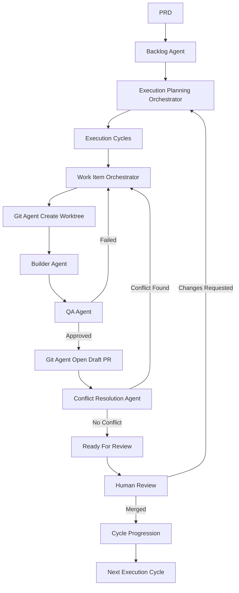
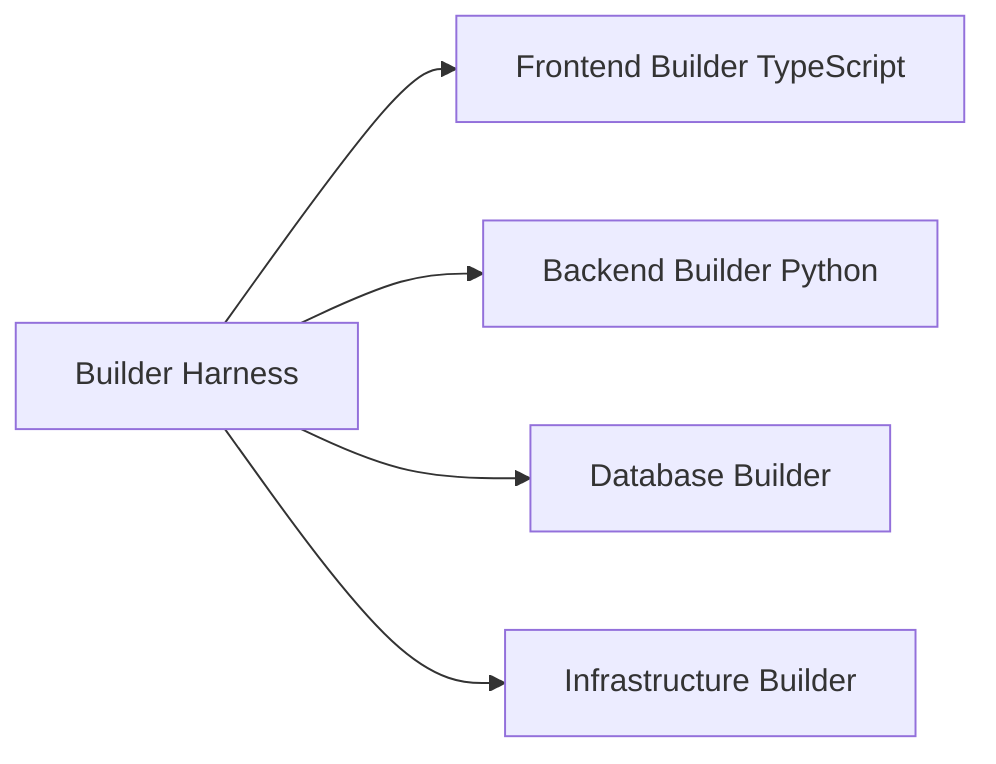
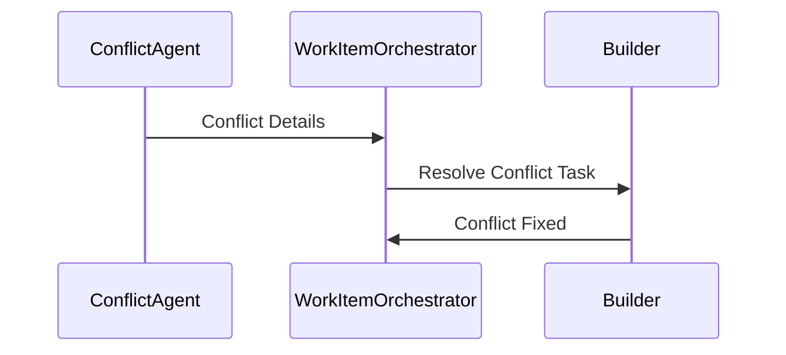
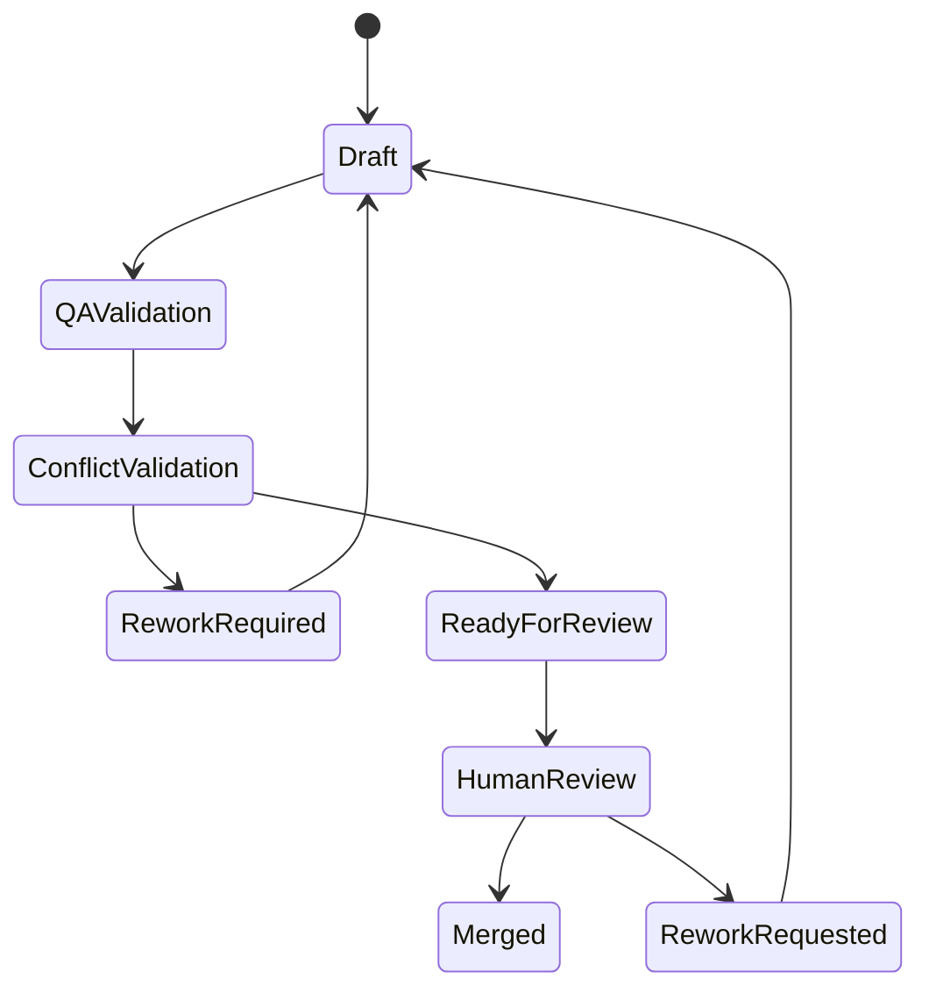
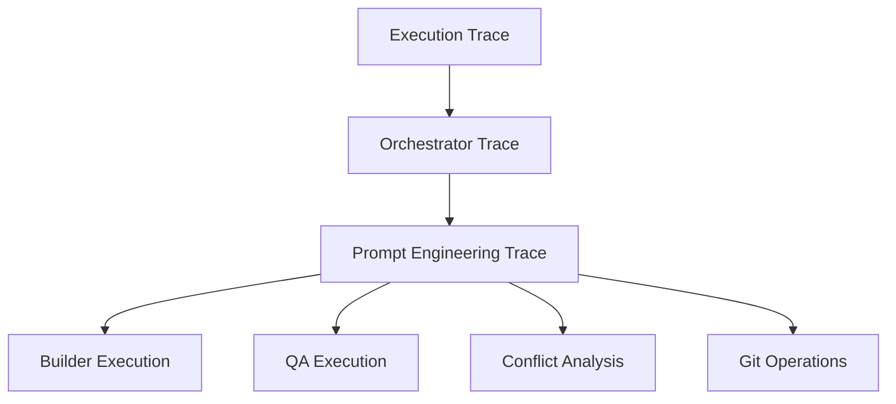

# Multi-Agent Autonomous Software Delivery Pipeline

## Overview

This document consolidates the complete architecture discussed for the autonomous multi-agent software delivery platform.

The system is designed to transform a structured PRD into executable implementation cycles using orchestrated AI agents, human-in-the-loop validation, Git workflows, QA validation, conflict resolution, and dynamic prompt engineering.

---

# Core Architectural Principles

- Strict separation of responsibilities
- No direct agent-to-agent communication
- All communication mediated by orchestrators
- Human-in-the-loop before merge
- Draft PR lifecycle
- Conflict validation before review readiness
- Dynamic prompt generation
- Full observability and traceability
- Stack-specialized builders
- Parallelizable execution cycles

---

# High-Level Execution Lifecycle



---

# Agents

## 1. Backlog Agent

### Responsibility

Transforms a PRD into structured delivery artifacts.

### Inputs

- PRD
- Stack definitions
- Technology constraints
- Business rules

### Outputs

- Epics
- User Stories
- Technical Tasks
- Acceptance Criteria
- Dependency Graph
- Stack Metadata

### Important Decisions

- The PRD must contain stack definitions
- Technical tasks are generated considering technology choices
- No execution planning occurs here

---

## 2. Execution Planning Orchestrator

### Responsibility

Plans execution cycles based on dependencies.

### Outputs

- Execution cycles
- Parallelizable task groups
- Dependency-aware sequencing

### Important Behavior

- Can re-plan dynamically
- Handles new user inputs
- Determines whether:
  - input becomes subtask
  - input becomes future scope
  - input blocks current cycle

### Key Rule

A cycle only advances when dependency requirements are satisfied.

---

## 3. Work Item Orchestrator

### Responsibility

Coordinates the lifecycle of a single task.

### Important Principle

No agent communicates directly with another agent.

ALL communication flows through this orchestrator.

### Responsibilities

- Create worktree request
- Delegate implementation
- Trigger QA
- Trigger conflict analysis
- Trigger PR creation
- Manage state transitions
- Handle retries
- Handle rework cycles

### Lifecycle Ownership

Starts:
- when a task becomes executable

Ends:
- when PR becomes Ready For Review

After this:
- human intervention begins
- execution planning resumes later

---

## 4. Builder Agent

### Responsibility

Implements code changes.

### Characteristics

- Stack specialized
- May delegate internally using harnesses
- Does NOT execute git operations
- Does NOT control flow
- Does NOT decide next actions

### Inputs

- Structured prompt
- Task details
- Repository context
- Stack metadata

### Outputs

- Code implementation
- Local branch state
- Completion signal

---

# Builder Harness Architecture

The Builder may internally orchestrate sub-builders.

Example:



This allows:
- specialization
- modularity
- independent scaling
- multi-stack execution

---

## 5. QA Agent

### Responsibility

Validates implementation quality.

### Validation Scope

- Linear task
- Acceptance criteria
- Codebase
- PR description
- Branch implementation

### Important Rule

QA NEVER communicates directly with Builder.

Flow:

```text
QA -> Work Item Orchestrator -> Builder
```

### Outputs

- Approval
- Findings
- Comments
- Rework requests

---

## 6. Git Agent

### Responsibility

Owns ALL git operations.

### Important Security Rule

Builder NEVER executes:
- git push
- git pull
- PR creation

### Responsibilities

- Create worktrees
- Create branches
- Sync branches
- Open draft PRs
- Manage labels
- Update PR state

---

## 7. Conflict Resolution Agent

### Responsibility

Analyzes merge conflicts.

### Important Rule

This agent DOES NOT implement fixes.

It ONLY:
- detects
- analyzes
- describes conflicts

### Conflict Fix Flow



### Trigger Moments

Conflict analysis occurs:

- after pull/sync
- after implementation completion
- after branch updates
- after upstream changes

### Important Decision

PR is NEVER marked Ready For Review if conflicts exist.

---

## 8. Linear Agent

### Responsibility

Handles all Linear interactions.

### Responsibilities

- Read tasks
- Read acceptance criteria
- Update statuses
- Create subtasks
- Add findings
- Close tasks

---

## 9. Prompt Engineering Agent

### Responsibility

Generates dynamic prompts for all agents.

### Why It Exists

Static prompts were considered too rigid.

Dynamic prompts:
- improve contextualization
- improve output quality
- adapt to agent role
- reduce prompt duplication

---

# Prompt Engineering Architecture

## Important Design Decision

The Prompt Engineering Agent DOES NOT freely invent prompts.

It renders prompts using:

- versioned templates
- structured schemas
- contextual blocks

---

## Prompt Composition

```text
- system_instruction
- role_definition
- task_context
- repository_context
- acceptance_criteria
- constraints
- expected_output_schema
- execution_policy
```

---

## Prompt Traceability

Every rendered prompt stores:

```text
template_id
template_version
target_agent
work_item_id
linear_issue_id
github_branch
github_pr
model
input_tokens
output_tokens
cost
rendered_prompt_hash
rendered_prompt_snapshot
```

---

# PR Lifecycle

## States



---

# Label-Based State Machine

PR states are represented via labels.

Examples:

```text
status:draft
status:qa-validation
status:conflict-validation
status:rework-required
status:ready-for-review
status:human-review
status:merged
```

---

# Human-In-The-Loop Model

Humans intervene ONLY at strategic points.

## Human Responsibilities

- PR review
- Merge approval
- Scope refinement
- New requirements
- Feedback

---

# Dynamic Scope Evolution

New user inputs may happen during review.

Execution Planning Orchestrator determines whether:

- current task refinement
- subtask creation
- future cycle allocation
- scope rejection

---

# Observability Strategy

## Proposed Stack

- LangFuse
- Structured tracing
- Prompt snapshots
- Agent execution traces
- Cost attribution

---

# Trace Hierarchy



---

# Final Architectural Principles

## Strong Separation of Responsibilities

Every agent has:
- one responsibility
- one execution boundary
- one output contract

---

## Orchestrator-Centric Architecture

Agents NEVER coordinate directly.

Orchestrators own:
- transitions
- retries
- sequencing
- lifecycle management

---

## Deterministic Lifecycle

The system behaves like a state machine.

No uncontrolled transitions occur.

---

# Final Result

The architecture now supports:

- autonomous software delivery
- multi-stack development
- dynamic replanning
- structured QA
- conflict validation
- deterministic workflows
- observability
- prompt traceability
- human governance
- scalable orchestration