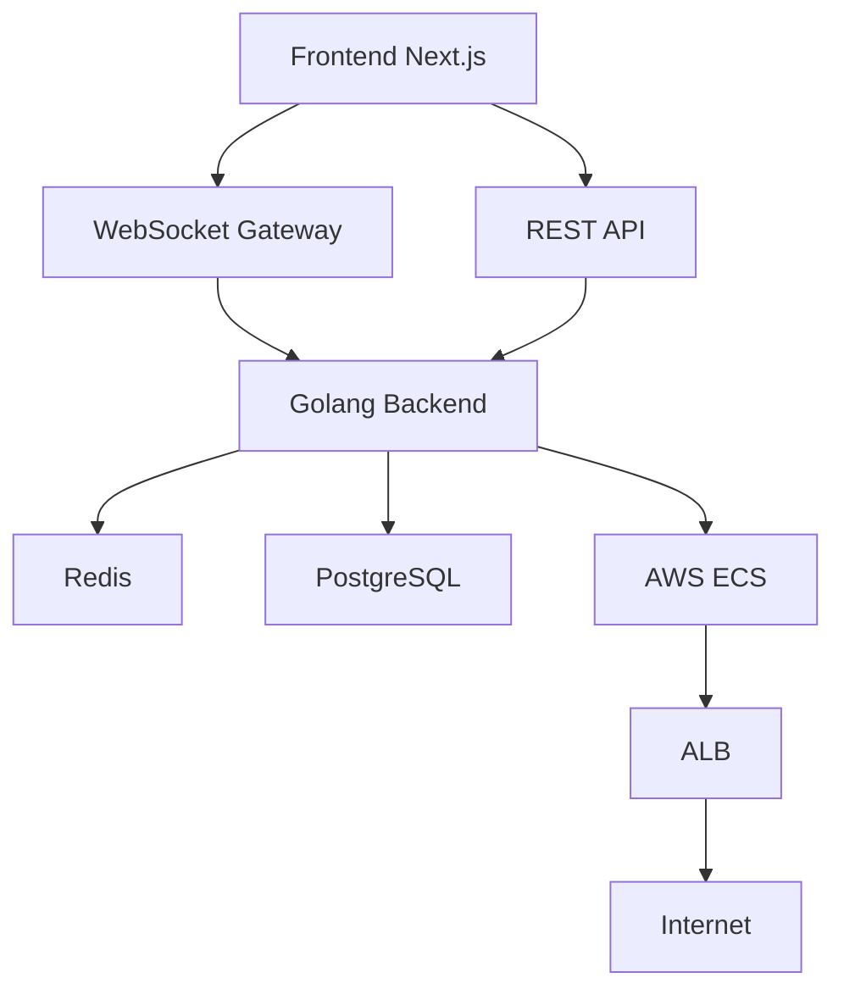

# PRD — Planning Poker Platform

## 1. Introduction

### 1.1 Product Overview

The Planning Poker Platform is a collaborative estimation tool designed for agile teams to estimate tasks in real time using the Planning Poker methodology.

The platform enables users to create virtual estimation rooms where participants can join through a shared link, discuss requirements, vote privately, reveal estimations simultaneously, and collaborate during planning sessions.

The solution is designed to work on both web and mobile devices, allowing distributed teams to collaborate seamlessly from different platforms.

---

## 2. Business Value

### 2.1 Why Planning Poker Matters

Planning Poker is widely used in agile methodologies because it helps teams:

- Improve estimation accuracy
- Reduce cognitive bias
- Encourage collaborative discussions
- Increase team engagement
- Align technical and business understanding
- Reduce dominance bias during estimations
- Surface hidden complexities earlier

By using secret voting and synchronized reveal mechanics, the process ensures that all participants contribute independently before discussions begin.

### 2.2 Product Value Proposition

The platform provides:

- Fast room creation
- Real-time collaboration
- Cross-device participation
- Lightweight onboarding
- Structured agile estimation workflows
- Low operational complexity
- Easy deployment and scalability

---

# 3. Product Goals

## 3.1 Main Goals

- Allow teams to perform agile estimations remotely
- Provide a lightweight and frictionless experience
- Support real-time interactions
- Enable collaborative discussions after voting
- Support both desktop and mobile usage
- Maintain a simple infrastructure footprint

---

# 4. Personas

## 4.1 Scrum Master / Room Master

Responsible for:

- Creating rooms
- Managing estimation flow
- Publishing questions
- Revealing votes
- Closing rooms
- Moderating discussions

## 4.2 Participant

Responsible for:

- Joining estimation sessions
- Voting privately
- Participating in discussions
- Following estimation progression

---

# 5. User Journey

## 5.1 Room Creation

1. User creates a room
2. User becomes the Room Master
3. System generates a shareable link
4. Participants access the room via link

## 5.2 Joining a Room

1. Participant opens shared link
2. Participant enters:
   - Display name
   - Optional avatar/photo
3. Participant joins room instantly

## 5.3 Estimation Flow

1. Master publishes a question/task
2. Participants select estimation cards
3. Votes remain hidden
4. Master triggers vote reveal
5. All votes become visible simultaneously
6. Team discusses estimations
7. Master moves to next question

---

# 6. Functional Requirements

## 6.1 Room Management

### Features

- Create room
- Join room
- Leave room
- Close room
- Reconnect to room
- Share room link

### Rules

- Only the Room Master can close the room
- Participants can join and leave anytime
- Room must support multiple concurrent users

---

## 6.2 Participant Management

### Features

- Minimal registration
- Name input
- Optional avatar upload
- Presence indication

### Rules

- Authentication is not required initially
- Participant identity is session-based

---

## 6.3 Estimation Questions

### Features

- Create questions manually
- Upload question lists
- Navigate between questions
- Publish questions individually

### Rules

- Only Room Master can control questions
- Questions are revealed sequentially

---

## 6.4 Voting System

### Features

- Secret voting
- Vote reveal
- Re-vote capability
- Fibonacci deck support
- T-Shirt size support (future)

### Rules

- Votes remain hidden until reveal
- Participants may change vote before reveal
- Reveal occurs simultaneously

---

## 6.5 Discussion System

### Features

- Post-vote comments
- Real-time discussion feed

### Rules

- Comments are attached to the current question

---

# 7. Non-Functional Requirements

## 7.1 Performance

- Real-time updates below 1 second latency
- Support concurrent voting events
- Fast room join experience

## 7.2 Scalability

- Horizontal scalability through ECS
- Stateless application containers

## 7.3 Availability

- Room state persistence
- Reconnection support

## 7.4 Security

- Secure room identifiers
- HTTPS-only communication
- Input validation

---

# 8. Technical Architecture

## 8.1 Frontend

### Stack

- Next.js
- React
- TypeScript
- TailwindCSS
- WebSocket client

### Responsibilities

- Real-time UI
- Voting interactions
- Room visualization
- Mobile responsiveness

---

## 8.2 Backend

### Stack

- Golang
- Gin or Fiber
- WebSocket support

### Responsibilities

- Room orchestration
- Vote synchronization
- Question management
- Session management

---

## 8.3 Database

### PostgreSQL

Responsible for:

- Room persistence
- Questions
- Session metadata
- Historical results

### Redis

Responsible for:

- Real-time session state
- Presence management
- WebSocket synchronization
- Temporary room cache

---

# 9. Infrastructure

## 9.1 Deployment Strategy

The platform should prioritize operational simplicity.

### Infrastructure Components

- AWS ECS
- Docker containers
- Application Load Balancer
- RDS PostgreSQL
- ElastiCache Redis
- Route53
- ACM SSL certificates

---

## 9.2 Containerization

### Requirements

- Single lightweight Docker image
- Simple CI/CD pipeline
- Environment-based configuration

---

# 10. Real-Time Communication

## 10.1 WebSocket Usage

WebSockets will be used for:

- Participant presence
- Vote updates
- Reveal synchronization
- Question publication
- Comment broadcasting

---

# 11. Suggested Database Entities

## Main Entities

### Room

- id
- code
- created_by
- created_at
- status

### Participant

- id
- room_id
- display_name
- avatar_url

### Question

- id
- room_id
- title
- description
- order

### Vote

- id
- participant_id
- question_id
- value
- revealed

### Comment

- id
- participant_id
- question_id
- message

---

# 12. UI/UX Considerations

## Room Layout

Participants should be visually displayed around a virtual table structure.

The Room Master should have a highlighted position.

### Mobile Support

The experience must adapt gracefully to:

- Smartphones
- Tablets
- Desktop browsers

---

# 13. Future Enhancements

## Possible Features

- Authentication
- Team workspaces
- Saved estimation history
- Jira integration
- Export estimation results
- AI-assisted estimation suggestions
- Voice discussion rooms
- Analytics dashboards

---

# 14. MVP Scope

## Included

- Room creation
- Shareable links
- Real-time participation
- Secret voting
- Vote reveal
- Question management
- Comments
- Mobile responsive UI

## Excluded Initially

- Advanced authentication
- Team management
- Integrations
- Analytics
- AI features

---

# 15. High-Level Architecture Diagram

---

# 16. Success Metrics

## Product Metrics

- Number of created rooms
- Average session duration
- Average participants per room
- Number of completed estimations
- User retention rate

## Technical Metrics

- WebSocket latency
- Room stability
- Deployment success rate
- Error rates

---

# 17. Conclusion

The Planning Poker Platform aims to provide a lightweight, scalable, and collaborative agile estimation experience with low operational complexity and strong real-time capabilities.

The project prioritizes simplicity, responsiveness, and ease of deployment while maintaining extensibility for future growth.
